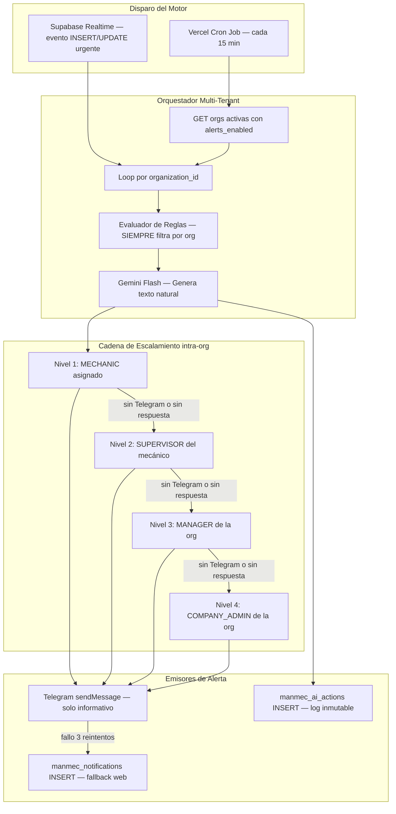

# 🤖 Análisis: Capa de IA Proactiva con Alertas Telegram — Manmec IA
**Versión:** 2.0 — Documento revisado y ampliado  
**Fecha:** 2026-04-13  
**Estado del código:** Sin modificaciones. Solo análisis y propuestas.

> **Principio rector de este documento:**  
> **Todo análisis, alerta y escalamiento es estrictamente por `organization_id`.**  
> Ninguna consulta, notificación ni cadena de escalamiento puede cruzar los límites de una organización.  
> El motor de alertas es multi-tenant por diseño.

---

## 1. Estado Actual del Proyecto (Diagnóstico)

El proyecto ya tiene una base extraordinariamente sólida para implementar la proactividad. No es un punto de partida vacío; es un sistema con las fundaciones completamente establecidas:

| Componente | Estado | Relevancia para IA Proactiva |
|---|---|---|
| `ManmecWorkOrder` con `priority` (P1–P4, PM) y `started_at` | ✅ Activo | Base principal de las alertas por SLA |
| `ManmecSupervisorAssignment` | ✅ Activo | **Eje del escalamiento** — une mecánico con su supervisor dentro de la org |
| `ManmecAiAction` | ✅ En schema | Tabla diseñada explícitamente para acciones proactivas de la IA |
| `ManmecNotification` | ✅ En schema | Canal de notificaciones en tiempo real vía Supabase Realtime (fallback web) |
| `ManmecAuditLog` | ✅ Inmutable vía triggers | Log transaccional que registra todos los cambios |
| `ManmecWorkOrderTimeline` | ✅ Activo | Historial cronológico detallado de cada OT |
| `ManmecUser.telegram_chat_id` + `onboarding_status` | ✅ Activo | Enlace directo a cada usuario en Telegram |
| `/api/telegram/webhook/route.ts` | ✅ Implementado | Bot funcional con auth, QR, voz y Text-to-SQL |
| `ManmecAiConversation / Messages` | ✅ En schema | Historial de conversaciones IA |
| Triggers de PostgreSQL | ✅ Activos | `trg_timeline_status_change` ya funciona |
| `manmec_organizations.settings` (JSON) | ✅ Activo | Almacén natural para la configuración de alertas por tenant |

> **Conclusión del diagnóstico:** La arquitectura actual no requiere rediseño. Necesita una capa de **orquestación proactiva multi-tenant** montada sobre los datos existentes.

---

## 2. Principio de Aislamiento por Organización (Multi-Tenant)

### 2.1 Regla de Oro

> **Toda consulta SQL del motor de alertas DEBE incluir `organization_id` como filtro obligatorio.**  
> No existe ningún análisis global que combine datos de distintas organizaciones.

```sql
-- ✅ CORRECTO
SELECT * FROM manmec_work_orders
WHERE organization_id = $1 AND status NOT IN ('COMPLETED','CANCELLED');

-- ❌ PROHIBIDO — mezclaría datos de todos los tenants
SELECT * FROM manmec_work_orders
WHERE status NOT IN ('COMPLETED','CANCELLED');
```

### 2.2 La Cadena de Escalamiento es 100% Intra-organización

```
OT vencida (org_id = X)
    ↓ Nivel 1
MECHANIC asignado (user.organization_id = X)
    ↓ Nivel 2 (si no reacciona en N min)
SUPERVISOR asignado al mecánico en ManmecSupervisorAssignment (organization_id = X)
    ↓ Nivel 3 (si no reacciona en N min)
Todos los MANAGER de la organización X
    ↓ Nivel 4 (último recurso)
COMPANY_ADMIN de la organización X
```

**Jamás** se escala fuera de la organización. Jamás se consulta `manmec_users` sin filtro de org.

### 2.3 Fallback: Usuario sin Telegram vinculado

Si un usuario de la cadena de escalamiento no tiene `telegram_chat_id` o su `onboarding_status != 'complete'`, el motor **no falla** — salta al siguiente nivel de la misma organización y registra el salto en `manmec_ai_actions.metadata`:

```typescript
async function sendAlertToUser(userId: string, message: string, orgId: string) {
  const user = await getUser(userId, orgId); // siempre con org
  if (!user.telegram_chat_id || user.onboarding_status !== 'complete') {
    // Registrar el salto, no lanzar error
    await logSkippedUser(userId, 'no_telegram', orgId);
    return false; // señal para escalar al siguiente nivel
  }
  return await sendTelegramMessage(user.telegram_chat_id, message);
}
```

### 2.4 Loop Multi-Tenant del Cron

El cron no ejecuta el motor una vez — lo ejecuta **una vez por organización activa** con alertas habilitadas:

```typescript
// /api/ai/alerts-engine/route.ts
export async function POST(req: NextRequest) {
  // Validar secret token
  const activeOrgs = await supabase
    .from('manmec_organizations')
    .select('id, settings, name')
    .is('deleted_at', null)
    .eq('settings->alert_rules->telegram_enabled', true);

  for (const org of activeOrgs.data) {
    // Ejecutar motor aislado por org — nunca mezcla datos
    await runAlertsEngineForOrg(org.id, org.settings.alert_rules);
  }
}
```

---

## 3. Arquitectura Propuesta: El Motor de Alertas Proactivo



### 3.1 Mecanismo de Disparo

| Mecanismo | Para qué usarlo | Latencia |
|---|---|---|
| **Vercel Cron (cada 15 min)** | Evaluación de SLA, countdowns, digests, predicciones | 15 min máx |
| **Supabase Realtime → Webhook** | P1 creada sin asignar, stock a cero, traspaso pendiente | < 2 seg |

> ⚠️ **Decisión de arquitectura:** No usar `pg_cron` para llamar APIs externas. Es difícil de depurar. El Cron de Vercel llama al endpoint de Next.js, que a su vez consulta Supabase. Esto mantiene toda la lógica de negocio en TypeScript, versionada en Git, sin depender de funciones SQL complejas.

> ⚠️ **Límite de Vercel Cron:** Las funciones serverless tienen 60 segundos de ejecución. Si hay muchas organizaciones activas, el motor debe ser eficiente. Solución: procesar orgs en paralelo con `Promise.allSettled()` y capturar errores por org sin que uno falle al resto.

### 3.2 Almacenamiento de Configuración (por organización)

```json
{
  "alert_rules": {
    "sla_hours": {
      "P1": 4,
      "P2": 12,
      "P3": 48,
      "P4": 120,
      "PM": null
    },
    "sla_start_event": "assigned_at",
    "reminder_thresholds_pct": [75, 90, 100],
    "reminder_thresholds_absolute": {
      "P3": [24, 8, 2],
      "P4": [48, 24, 4]
    },
    "escalation_timeouts_min": {
      "to_supervisor": 30,
      "to_manager": 60,
      "to_admin": 90
    },
    "notify_roles": ["MECHANIC", "SUPERVISOR", "MANAGER"],
    "working_hours": {
      "start": "07:00",
      "end": "21:00",
      "timezone": "America/Santiago"
    },
    "stock_alert_enabled": true,
    "anomaly_min_samples": 15,
    "transfer_pending_alert_hours": 2,
    "idle_mechanic_alert_minutes": 60,
    "telegram_enabled": true,
    "digest_hour": "07:00",
    "silence_hours": {
      "start": "22:00",
      "end": "06:59"
    },
    "alert_window_days": {
      "P1": 2,
      "P2": 5,
      "P3": 14,
      "P4": 30,
      "PM": 7
    },
    "zombie_ot_threshold_days": {
      "P1": 3,
      "P2": 10,
      "P3": 21,
      "P4": 45
    }
  }
}
```

> **Nota:** El campo `timezone` se agrega a `manmec_organizations` como campo de base de datos (ver sección 7 — migraciones). El JSON de settings lo referencia, pero la fuente de verdad es el campo de la tabla.

---

## 4. Alertas Propuestas: SLA por Prioridad (P1–P4)

### 4.1 Corrección Crítica: El SLA NO empieza en `created_at`

> ❌ **Error del diseño original:** `T_restante = SLA_horas - (NOW() - wo.created_at)`  
> Una OT puede pasar horas en `PENDING` sin que nadie la tome. Contar desde la creación significaría que la P1 vence antes de que el mecánico siquiera la vea.

> ✅ **Fórmula corregida:**
```
T_restante = SLA_horas - (NOW() - wo.started_at)
```
Donde `started_at` es el momento en que la OT pasó a estado `IN_PROGRESS` o `ASSIGNED`.  
Si `started_at IS NULL` (OT recién creada y sin asignar), el SLA no corre para el mecánico — pero sí aplica OT-02 (alerta de OT sin asignar).

### 4.2 Filtro Cronológico: Ventana de Activación por Prioridad

> **Problema operacional real:** Una OT que lleva 2 meses abierta y no ha sido cerrada no es candidata a un countdown de SLA — es un error operativo distinto. El mecánico probablemente ya resolvió el problema en terreno pero nunca cerró la OT en el sistema. Enviar una alerta de "te quedan 2h" para una P2 de hace 2 meses es ruido irrelevante que daña la confianza en el sistema de alertas.

El motor de alertas aplica un **filtro cronológico obligatorio** antes de evaluar cualquier OT. Si la OT supera la "ventana de activación" configurada para su prioridad, **sale del flujo de SLA countdown** y entra al flujo de "OT Fantasma" (ver OT-08).

```typescript
// src/lib/alerts/sla.ts
function isWithinAlertWindow(wo: WorkOrder, rules: AlertRules): boolean {
  const windowDays = rules.alert_window_days[wo.priority];
  if (!windowDays) return true; // PM sin ventana
  const referenceDate = wo.started_at ?? wo.created_at;
  const ageInDays = (Date.now() - new Date(referenceDate).getTime()) / 86_400_000;
  return ageInDays <= windowDays;
}

// En el motor, antes de evaluar cualquier alerta de SLA:
const activeOTs = allOpenOTs.filter(wo => isWithinAlertWindow(wo, rules));
const zombieOTs = allOpenOTs.filter(wo => !isWithinAlertWindow(wo, rules));

// Solo activeOTs reciben alertas de countdown.
// zombieOTs generan la alerta OT-08 (una vez por semana, no cada 15 min).
```

**Ventanas de activación por prioridad (configurables por org):**

| Prioridad | SLA | Ventana máx. de alertas activas | Lógica |
|---|---|---|---|
| **P1** | 4h | **2 días** | Pasados 2 días, es imposible que sea aún válida como urgente |
| **P2** | 12h | **5 días** | Una semana laboral máximo |
| **P3** | 48h | **14 días** | Dos semanas; más allá es error de cierre |
| **P4** | 120h | **30 días** | Un mes; más allá es definitivamente zombie |
| **PM** | Sin SLA | **7 días** (antes de `scheduled_date`) | Solo recordatorio previo |

> ✅ Esto protege el sistema de dos patrones nocivos que ocurren en terreno:  
> 1. **OT resuelta pero no cerrada:** El mecánico arregló el equipo y se fue sin actualizar el app.  
> 2. **OT mal creada / duplicada:** Se creó por error y nunca se asignó ni se canceló.

### 4.3 Umbrales: Porcentual para P1/P2, Absolutos para P3/P4

Los umbrales porcentuales no funcionan bien en SLAs largos. Para una P4 de 120h, "50%" = alerta a las 60h, lo cual no tiene valor operacional.

| Prioridad | SLA | Alerta 1 | Alerta 2 | Alerta 3 | Vencida |
|---|---|---|---|---|---|
| **P1** | 4h | 75% → 1h restante | 90% → 24 min restantes | — | 100% → escala a SUPERVISOR |
| **P2** | 12h | 4h restantes | 2h restantes | 1h restante | 100% → escala a SUPERVISOR |
| **P3** | 48h | 24h restantes | 8h restantes | 2h restantes | 100% → escala a MANAGER |
| **P4** | 120h | 48h restantes | 24h restantes | 4h restantes | 100% → escala a MANAGER |
| **PM** | Sin SLA | Recordatorio 48h antes de `scheduled_date` | — | — | — |

### 4.3 Cadena de Escalamiento por Prioridad y Destinatario

| Evento | Destinatario | Nivel | Canal |
|---|---|---|---|
| SLA al 75% — P1/P2 | MECHANIC asignado (mismo org) | 1 | Telegram (o web si no tiene) |
| SLA al 90% — P1/P2 | MECHANIC + SUPERVISOR del mecánico (mismo org) | 1+2 | Telegram |
| SLA vencido — P1/P2 | SUPERVISOR + MANAGER (mismo org) | 2+3 | Telegram |
| SLA vencido + 30min — P1/P2 | MANAGER + COMPANY_ADMIN (mismo org) | 3+4 | Telegram |
| SLA vencido — P3/P4 | SUPERVISOR (mismo org) | 2 | Telegram |
| OT P1 sin asignar +15min | SUPERVISOR (mismo org) | 2 | Telegram urgente |
| Digest 7am | SUPERVISOR + MANAGER (mismo org) | 2+3 | Telegram |

### 4.4 Anti-spam: Control de Envíos

- Cada alerta se registra en `manmec_ai_actions` con `alert_key` único (formato: `{org_id}:{wo_id}:{threshold}:{role}`).
- El motor verifica si ya se envió esa combinación antes de reenviar.
- Si la OT pasa a `COMPLETED` o `CANCELLED`, el motor marca como `is_acknowledged = true` todas las alertas pendientes de esa OT en `manmec_ai_actions`.
- Fuera del `working_hours` configurado, solo se envían alertas de severidad `critical`. Las `info` y `warning` se encolan y se entregan al inicio del próximo horario laboral.

### 4.5 Fallback si Telegram Falla

Si el envío a Telegram falla (timeout, bot bloqueado, error 429):
1. Reintentar hasta 3 veces con backoff exponencial (1s, 2s, 4s).
2. Si los 3 reintentos fallan: insertar la alerta en `manmec_notifications` (canal web, Supabase Realtime).
3. Registrar el fallo en `manmec_ai_actions.metadata.telegram_error`.
4. En el próximo ciclo del cron, el motor detecta alertas con `telegram_error` y reintenta enviarlas.

---

## 5. Catálogo Completo de Alertas Proactivas

> Cada alerta indica **Destinatario** (rol dentro de la misma organización) y **Lógica de Escalamiento**.

### 5.1 🔴 MÓDULO: Gestión de OTs

| ID | Alerta | Destinatario Principal | Escalamiento | Trigger | Complejidad |
|---|---|---|---|---|---|
| **OT-01** | Countdown SLA (P1–P4) | MECHANIC asignado | → SUPERVISOR → MANAGER → ADMIN | Vercel Cron c/15 min | ⭐⭐ |
| **OT-02** | OT P1 creada sin asignar mecánico en 15 min | SUPERVISOR de la org | → MANAGER si +30min | Supabase Realtime INSERT | ⭐ |
| **OT-03** | OT en `PAUSED` por más de X horas | SUPERVISOR del mecánico | Sin escalamiento | Vercel Cron | ⭐ |
| **OT-04** | OT sin actividad en timeline en 2h (IN_PROGRESS) | MECHANIC asignado | → SUPERVISOR si +1h | Vercel Cron | ⭐⭐ |
| **OT-05** | Mecánico asignado a 3+ OTs simultáneas activas | SUPERVISOR del mecánico | Sin escalamiento | Supabase Realtime INSERT | ⭐⭐ |
| **OT-06** | OT P1 resuelta antes del SLA — celebración + KPI | MECHANIC + SUPERVISOR (mismo org) | Sin escalamiento | Supabase Realtime UPDATE | ⭐ |
| **OT-07** | Silencio operacional: org sin actividad 6h en horario laboral | MANAGER + COMPANY_ADMIN (mismo org) | Sin escalamiento | Vercel Cron | ⭐⭐ |
| **OT-08** | OT Fantasma: OT abierta que superó su ventana de activación (posiblemente resuelta en terreno sin cerrarse) | SUPERVISOR (mismo org) | → MANAGER si +7 días | Vercel Cron semanal | ⭐⭐ |

**Ejemplo OT-02 (P1 sin asignar):**
```
🆘 ALERTA URGENTE — SIN MECÁNICO
OT #AVISO-4521 (P1 — "Bomba principal fuera de servicio")
📍 EDS Los Héroes — creada hace 18 minutos.
Aún no tiene mecánico asignado.
Ingresa a la plataforma para asignar a alguien de inmediato.
```

**Ejemplo OT-06 (celebración de buen desempeño):**
```
🏆 ¡Excelente desempeño!
Carlos Rodríguez resolvió la OT P1 #AVISO-45821 en 2h 14min.
SLA de 4 horas cumplido ✅
Rendimiento hoy: 3/3 P1s resueltas dentro del SLA.
```

**Ejemplo OT-07 (silencio operacional):**
```
⚠️ Silencio inusual detectado
No se registra actividad en Manmec desde hace 6 horas (horario laboral).
¿El sistema está recibiendo avisos correctamente?
Verifica la integración con tu fuente de órdenes de trabajo.
```

**Ejemplo OT-08 (OT Fantasma — resumen semanal, NO countdown):**
```
👻 Reporte semanal — OTs Fantasma detectadas

Se encontraron 3 órdenes de trabajo abiertas que superaron su ventana
operacional y es probable que hayan sido resueltas en terreno sin cerrar en sistema:

• OT #AVISO-3201 (P2 · EDS Ñuñoa · asignada a Luis M.) — 18 días abierta
• OT #AVISO-2987 (P3 · EDS Yungay · asignada a Carlos R.) — 22 días abierta
• OT #AVISO-3044 (P1 · EDS Maipú · sin mecánico asignado) — 4 días abierta ⚠️

Ingresa a la plataforma para cerrar o cancelar estas OTs según corresponda.
El sistema NO enviará alertas de SLA por estas órdenes hasta que sean actualizadas.
```

> 💡 **Nota de diseño OT-08:** Este reporte NO se envía cada 15 minutos (sería spam).
> Se envía **una vez por semana** (ej: lunes 8am) y solo si hay OTs fantasma activas.
> El motor excluye estas OTs del countdown de SLA para no generar ruido operacional.

### 5.2 📦 MÓDULO: Inventario y Stock

| ID | Alerta | Destinatario Principal | Escalamiento | Trigger | Complejidad |
|---|---|---|---|---|---|
| **INV-01** | Stock ítem bajo mínimo configurado | SUPERVISOR de la org | → MANAGER si crítico | Supabase Realtime UPDATE stock | ⭐ |
| **INV-02** | Predicción de quiebre: ítem se agotará en N días | SUPERVISOR + MANAGER (mismo org) | Sin escalamiento | Vercel Cron diario | ⭐⭐⭐ |
| **INV-03** | Consumo anómalo: +200% vs promedio 30d (mín 15 muestras) | SUPERVISOR de la org | → MANAGER | Vercel Cron | ⭐⭐⭐ |
| **INV-04** | Traspaso express pendiente de aceptar hace 2h | MECHANIC receptor | → SUPERVISOR si +1h | Vercel Cron | ⭐ |
| **INV-05** | Furgón (bodega móvil) con stock < 10% en ítems críticos | MECHANIC del furgón + SUPERVISOR | Sin escalamiento | Vercel Cron | ⭐⭐ |
| **INV-06** | Guía de despacho recibida con diferencias vs pedido | SUPERVISOR de bodega (mismo org) | → MANAGER | Supabase Realtime INSERT shipment | ⭐⭐ |

**Ejemplo INV-02 (Predicción):**
```
📊 PREDICCIÓN DE QUIEBRE — Filtros de Aceite
Al ritmo de consumo de los últimos 14 días (2.3 filtros/día),
el stock actual de 8 unidades en Bodega Central se agotará el próximo JUEVES.
Ingresa a la plataforma para generar la solicitud de reposición.
```

**Ejemplo INV-03 (Anomalía — requiere mín. 15 muestras históricas):**
```
🔍 Consumo inusual detectado
El repuesto "PROTECCIÓN PLAST. AZUL PISTOLA 1" registra 320% más consumo
que el promedio de las últimas 4 semanas. Zona afectada: Norte (3 EDS).
Revisa la plataforma para analizar el detalle por estación.
```

### 5.3 👷 MÓDULO: Operaciones de Campo

| ID | Alerta | Destinatario Principal | Escalamiento | Trigger | Complejidad |
|---|---|---|---|---|---|
| **OP-01** | Mecánico sin OTs asignadas hace +2h en horario laboral | SUPERVISOR del mecánico | Sin escalamiento | Vercel Cron | ⭐⭐ |
| **OP-02** | OT completada — informar cierre al supervisor | SUPERVISOR del mecánico (mismo org) | Sin escalamiento | Supabase Realtime UPDATE | ⭐ |
| **OP-03** | Digest matutino operativo (7am) | SUPERVISOR + MANAGER (mismo org) | Sin escalamiento | Vercel Cron (schedule) | ⭐⭐ |
| **OP-04** | Mecánico cerca de OT sin asignar — optimización ruta (Post-MVP GPS) | SUPERVISOR (mismo org) | Sin escalamiento | GPS trigger | ⭐⭐⭐⭐ |
| **OP-05** | Herramienta crítica no devuelta después de OT completada | MECHANIC asignado + SUPERVISOR | → MANAGER si +4h | Supabase Realtime UPDATE OT | ⭐⭐ |

**Ejemplo OP-01 (mécanico sin actividad):**
```
😴 Sin actividad: Carlos Rodríguez
Carlos lleva 2.5 horas sin OTs activas en horario laboral.
Hay 3 avisos P3 sin asignar en su zona.
Ingresa a la plataforma para revisar la distribución de carga.
```

**Ejemplo OP-03 (Digest 7am — por organización):**
```
🌅 Buenos días, Supervisor Juan — Resumen operativo [Orgnización Copec Norte]

📋 OTs activas: 4 (1 P1 · 2 P2 · 1 P3)
👷 Mecánicos disponibles: 3
📦 Ítems en stock crítico: 2
🔄 Traspasos pendientes de aceptar: 1
⚠️ La P1 de EDS Yungay vence en 2h

Ingresa a la plataforma para gestionar el día.
```

### 5.4 🚚 MÓDULO: Logística y Despacho

| ID | Alerta | Destinatario Principal | Escalamiento | Trigger | Complejidad |
|---|---|---|---|---|---|
| **LOG-01** | Pre-guía de despacho recibida — avisar a bodeguero | SUPERVISOR de bodega (mismo org) | Sin escalamiento | Supabase Realtime INSERT shipment | ⭐ |
| **LOG-02** | Camión sin confirmar recepción pasadas 4h de la guía | SUPERVISOR + MANAGER (mismo org) | → ADMIN | Vercel Cron | ⭐ |
| **LOG-03** | Transferencia entre furgones aprobada — ambos notificados | MECHANIC sender + MECHANIC receiver (mismo org) | Sin escalamiento | Supabase Realtime UPDATE transfer | ⭐ |

### 5.5 📈 MÓDULO: KPIs Proactivos (Gemini Analytics)

| ID | Alerta | Destinatario | Frecuencia | Complejidad |
|---|---|---|---|---|
| **KPI-01** | Digest diario 7am: resumen del día | SUPERVISOR + MANAGER (mismo org) | Cron 7am (por timezone de org) | ⭐⭐ |
| **KPI-02** | Reporte semanal: Top 5 causas de OTs correctivas | MANAGER + COMPANY_ADMIN (mismo org) | Cron Lunes 8am | ⭐⭐⭐ |
| **KPI-03** | Eficiencia del equipo: tiempo promedio de resolución por mecánico | MANAGER (mismo org) | Cron semanal | ⭐⭐⭐ |
| **KPI-04** | SLA cumplimiento: % de OTs resueltas a tiempo este mes | COMPANY_ADMIN (mismo org) | Cron 1ro de mes | ⭐⭐ |

---

## 6. Política de Datos en Mensajes Telegram

> Canal Telegram = **solo informativo**. No se toman decisiones desde Telegram. Toda acción se realiza en la plataforma web.

### ✅ Permitido en mensajes Telegram

- Código externo de OT (`external_id` / número de aviso)
- Nombre de estación de servicio (`station.name`, `station.code`)
- Nombre del mecánico asignado (`user.full_name`)
- Prioridad y estado de la OT
- Tiempo restante del SLA (expresado en horas/minutos)
- Nombre del ítem de inventario y cantidad genérica (sin costos)
- Nombre de la organización

### ❌ Prohibido en mensajes Telegram

- `id` interno UUID de cualquier entidad (seguridad)
- RUT, datos de contacto o datos personales de clientes
- Precios o costos de materiales
- Números de órdenes de compra o datos financieros
- Datos de guías de despacho con información comercial
- Cualquier dato que pueda identificar una persona específica fuera del contexto laboral

---

## 7. Modificaciones de Base de Datos Requeridas

### 7.1 Tabla `manmec_organizations` — Campos nuevos

```sql
-- Zona horaria de la organización (fuente de verdad para digest y cron)
ALTER TABLE manmec_organizations
  ADD COLUMN timezone TEXT NOT NULL DEFAULT 'America/Santiago';
```

### 7.2 Tabla `manmec_ai_actions` — Campos nuevos

```sql
-- alert_key: identificador único para deduplicación (anti-spam)
-- Formato sugerido: {org_id}:{entity_id}:{alert_type}:{threshold}:{role}
ALTER TABLE manmec_ai_actions
  ADD COLUMN alert_key TEXT UNIQUE,
  ADD COLUMN sent_at TIMESTAMPTZ,
  ADD COLUMN retry_count INT DEFAULT 0,
  ADD COLUMN telegram_error TEXT;

-- Índice para búsqueda eficiente de alertas ya enviadas
CREATE INDEX idx_ai_actions_alert_key ON manmec_ai_actions(alert_key)
  WHERE is_acknowledged = false;

-- Índice para dashboard de historial de alertas por org
CREATE INDEX idx_ai_actions_org_created ON manmec_ai_actions(organization_id, created_at DESC);
```

> ⚠️ No se requiere reestructurar el schema existente. Solo **adiciones aditivas** no destructivas.

---

## 8. Análisis de Impacto por Skill Global (actualizado)

### 🗂️ SKILL: `database-design` + `postgresql`

**Modificaciones requeridas:**

| Cambio | Objeto | Criticidad | Esfuerzo |
|---|---|---|---|
| Campo `timezone` en `manmec_organizations` | Migración Prisma | Alta | 30 min |
| Campo `alert_key` (unique) en `manmec_ai_actions` | Migración Prisma | Alta (anti-spam) | 1h |
| Campos `sent_at`, `retry_count`, `telegram_error` en `manmec_ai_actions` | Migración Prisma | Alta | 30 min |
| Dos nuevos índices en `manmec_ai_actions` | SQL directo en Supabase | Media | 15 min |
| JSON `alert_rules` ampliado en `settings` | Sin migración | Alta | 0 |

**Esfuerzo total: 3–4h**

---

### 🤖 SKILL: `gemini-api-dev`

**Rol de Gemini en la capa proactiva:**
- Generación de mensajes en lenguaje natural basados en datos crudos de la alerta (siempre recibe `organization_id` en el contexto).
- Análisis estadístico para detección de anomalías (INV-03) — solo si hay ≥15 muestras históricas.
- No genera SQL de escritura. Solo lectura vía `executeReadOnlyQuery`.

**Nuevos archivos:**

| Cambio | Archivo | Esfuerzo |
|---|---|---|
| Nueva función `generateAlertMessage(alert, orgContext)` | `src/lib/ai/gemini.ts` | 2–3h |
| Prompt especializado `promptAlertaOperacional` | `src/lib/ai/prompts.ts` | 1h |
| Análisis estadístico con umbral mínimo de muestras | `src/lib/ai/analytics.ts` (nuevo) | 4–6h |

**Modelo:** Gemini Flash para alertas (rápido, barato). Gemini Pro solo para KPI-02/03 (análisis semanal).

**Esfuerzo total: 7–10h**

---

### 📱 SKILL: `telegram-automation`

**Principio:** Canal solo informativo (One-Way). No hay Inline Keyboards. No hay `callback_query`.

| Cambio | Descripción | Esfuerzo |
|---|---|---|
| Extraer `sendTelegramMessage` a utilidad compartida | Crear `src/lib/telegram/sender.ts` independiente del webhook | 1h |
| Rate limiting + cola simple | Respetar 20 msg/min por usuario — acumular y despachar | 2h |
| Envío con reintentos (backoff exponencial) | 3 reintentos antes de fallback a `manmec_notifications` | 1h |
| Envío a múltiples destinatarios por rol dentro de org | `sendTelegramToRole(orgId, role, message)` | 1h |
| Parse mode HTML robusto | Migrar de Markdown a HTML para evitar errores de formato | 1h |
| Notificación silenciosa fuera de horario laboral | `disable_notification: true` + respeto de `working_hours` | 1h |

**Esfuerzo total: 7h**

---

### 🏗️ SKILL: `backend-architect` + `api-patterns`

**Nuevos archivos y estructura:**

```
src/
├── lib/
│   ├── ai/
│   │   ├── gemini.ts           (existente — agregar generateAlertMessage)
│   │   ├── prompts.ts          (existente — agregar promptAlertaOperacional)
│   │   └── analytics.ts        (NUEVO — análisis estadístico con mín. muestras)
│   ├── telegram/
│   │   └── sender.ts           (NUEVO — envío con reintentos, rate limit, HTML)
│   └── alerts/
│       ├── engine.ts           (NUEVO — loop multi-org, orquestador principal)
│       ├── rules.ts            (NUEVO — definición de 25 reglas por módulo)
│       ├── sla.ts              (NUEVO — cálculo SLA desde started_at, umbrales abs.)
│       ├── escalation.ts       (NUEVO — cadena MECHANIC→SUPERVISOR→MANAGER→ADMIN)
│       └── scheduler.ts        (NUEVO — lógica working_hours, silence_hours, tz)
└── app/
    └── api/
        └── ai/
            └── alerts-engine/
                └── route.ts    (NUEVO — endpoint seguro para Vercel Cron)
```

**Motor principal (pseudocódigo actualizado):**

```typescript
// src/lib/alerts/engine.ts
export async function runAlertsEngineForOrg(orgId: string, rules: AlertRules) {
  // Siempre filtra por org — nunca cruza límites de tenant
  const activeWOs = await getActiveWorkOrders(orgId);
  const slaViolations = await evaluateSla(activeWOs, rules, orgId);
  const stockAlerts = await evaluateStock(orgId, rules);
  const operationalAlerts = await evaluateOperations(orgId, rules);

  const allAlerts = [...slaViolations, ...stockAlerts, ...operationalAlerts];

  await Promise.allSettled(
    allAlerts.map(async (alert) => {
      const alreadySent = await checkAlertKey(alert.key, orgId);
      if (alreadySent) return;

      if (!isWithinWorkingHours(rules.working_hours) && alert.severity !== 'critical') {
        await queueForNextWorkday(alert, orgId);
        return;
      }

      const message = await generateAlertMessage(alert, { orgId });
      await saveAiAction(alert, orgId); // siempre registra

      const escalationChain = await buildEscalationChain(alert, orgId);
      for (const user of escalationChain) {
        const sent = await sendAlertToUser(user.id, message, orgId);
        if (sent) break; // éxito: no escalar más en este ciclo
      }
    })
  );
}
```

**Esfuerzo total: 15–20h (la parte más compleja del sistema)**

---

### 🎨 SKILL: `frontend-design` + `ui-ux-designer`

| Cambio | Ubicación | Esfuerzo |
|---|---|---|
| Panel "Configuración de Alertas" en Settings | `src/app/dashboard/settings/alerts/page.tsx` (nuevo) | 4–6h |
| Editor visual de SLA por prioridad (sliders) | Componente `SlaConfigEditor` | 3–4h |
| Toggle de alertas por tipo y módulo | Componente `AlertRulesToggle` | 2h |
| Selector de horario laboral + zona horaria | Time range picker en Settings | 2h |
| Configuración de silenciamiento por usuario | Perfil de usuario → preferencias Telegram | 2h |
| Preview de mensaje Telegram en configuración | Componente de preview informativo (sin botones) | 2h |
| **Historial de Alertas enviadas** (vista nueva) | `src/app/dashboard/alerts/history/page.tsx` | 4–5h |
| Badge de alertas activas en sidebar | Feed de `manmec_ai_actions` no reconocidas | 1–2h |

**Esfuerzo total: 20–23h**

---

### 🔐 SKILL: `security-auditor` + `secrets-management`

| Riesgo | Mitigación | Esfuerzo |
|---|---|---|
| Endpoint `/api/ai/alerts-engine` público | Secret token en Authorization header (Bearer) | 30 min |
| Cruce de datos entre organizaciones | `organization_id` obligatorio en TODAS las queries del motor | Revisión en code review |
| Gemini podría generar SQL con acceso a otras orgs | `executeReadOnlyQuery` ya fuerza filtro de org — reutilizar | 0 |
| Datos sensibles en mensajes Telegram | Política de datos definida en sección 6 — validar en prompts | 1h |
| Usuario sin Telegram recibe skip silencioso | Logging en `metadata` de `manmec_ai_actions` | 30 min |
| Timeout de Vercel Cron con muchas orgs | `Promise.allSettled()` + timeout por org de 45s | 2h |

**Esfuerzo total: 4h**

---

### 📊 SKILL: `analytics-tracking` + `llm-evaluation`

**Métricas a instrumentar en `manmec_ai_actions.metadata` desde Día 1:**

| Métrica | Dónde se guarda | Para qué |
|---|---|---|
| Alertas enviadas vs reconocidas (`is_acknowledged`) | `manmec_ai_actions` | Medir relevancia de alertas |
| Tiempo entre alerta y resolución de OT | OT `completed_at` vs `sent_at` | Medir efectividad de SLA alerts |
| Usuarios saltados por falta de Telegram | `metadata.skipped_users[]` | Detectar usuarios sin onboarding |
| Costo de tokens Gemini por alerta | `metadata.tokens_used` | Controlar opex de IA |
| Fallos de Telegram (`retry_count`, `telegram_error`) | Campos directos en tabla | Detectar problemas de entrega |
| Alertas suprimidas por horario laboral | `metadata.suppressed_reason` | Ajustar working_hours |

---

## 9. Resumen de Esfuerzo Global (actualizado)

| Área | Archivos Nuevos / Modificados | Esfuerzo | Prioridad |
|---|---|---|---|
| **Base de Datos** (migraciones + índices) | 1 migración Prisma + 2 índices SQL | 3–4h | 🔴 Alta |
| **Motor de Alertas** (backend core) | `engine.ts`, `sla.ts`, `rules.ts`, `escalation.ts`, `scheduler.ts` | 15–20h | 🔴 Alta |
| **Telegram Sender** (refactor + reintentos) | `telegram/sender.ts` | 7h | 🔴 Alta |
| **API Endpoint** (cron + seguridad) | `api/ai/alerts-engine/route.ts` | 3–4h | 🔴 Alta |
| **Gemini IA** (mensajes + analytics) | `gemini.ts`, `prompts.ts`, `analytics.ts` | 7–10h | 🟠 Media |
| **Frontend Settings + Historial** | 2 páginas nuevas + 5 componentes | 20–23h | 🟠 Media |
| **Seguridad** (validaciones + multi-tenant audit) | Middleware + revisión | 4h | 🟠 Media |
| **Testing** (humo en staging) | Tests de integración | 4–6h | 🟡 Baja |
| **TOTAL ESTIMADO** | | **63–78h** | |

---

## 10. Roadmap Actualizado (4 Sprints)

### Sprint 1 — Fundación Multi-Tenant (1 semana, ~18h)
1. Migración Prisma: `timezone` en org, `alert_key`/`sent_at`/`retry_count` en `manmec_ai_actions`
2. Crear `src/lib/telegram/sender.ts` con reintentos y fallback a `manmec_notifications`
3. Crear `src/lib/alerts/sla.ts` — fórmula corregida con `started_at`, umbrales absolutos
4. Crear `src/lib/alerts/escalation.ts` — cadena de roles por org usando `ManmecSupervisorAssignment`
5. Crear `src/lib/alerts/scheduler.ts` — lógica `working_hours` y `silence_hours` con timezone
6. Crear endpoint `/api/ai/alerts-engine` con Bearer token + loop multi-org
7. **Entregable:** Primera alerta funcional end-to-end — OT-01 countdown P1 → MECHANIC → SUPERVISOR (mismo org)

### Sprint 2 — Motor Completo (1 semana, ~22h)
1. Reglas OT-02 (P1 sin asignar) y OT-03 (pausa excesiva)
2. Reglas INV-01 (stock crítico) e INV-04 (traspaso pendiente)
3. Digest matutino KPI-01 con timezone de org (7am local, no UTC)
4. `generateAlertMessage` con Gemini Flash
5. Anti-spam completo: deduplicación por `alert_key`
6. Alerta OT-07 (silencio operacional)
7. **Entregable:** 10 alertas activas en producción

### Sprint 3 — UI de Configuración + Historial (1 semana, ~20h)
1. Panel Settings → Alertas (sliders SLA, toggles por tipo, timezone, horario laboral)
2. Panel Settings → Silenciamiento por usuario
3. Vista "Historial de Alertas" para supervisores y managers
4. Badge de alertas activas en sidebar
5. Preview de mensaje Telegram en configuración
6. **Entregable:** Configuración completa desde la UI, sin tocar la BD manualmente

### Sprint 4 — Analytics IA Avanzado (1 semana, ~15h)
1. INV-02 (predicción de quiebre) y INV-03 (anomalía, con umbral mínimo de 15 muestras)
2. KPI-02 y KPI-03 (reportes semanales con Gemini Pro)
3. Alerta positiva OT-06 (celebración de P1 resuelta)
4. OP-04 Post-MVP GPS (diseño solamente, sin implementar)
5. Métricas de efectividad en `manmec_ai_actions.metadata`
6. **Entregable:** Sistema proactivo completo de 25 alertas

---

## 11. Ejemplo de Mensaje Telegram: Countdown P1 (versión final)

```
🚨 ALERTA SLA — PRIORIDAD 1

📋 OT #AVISO-45821
📍 EDS Los Héroes — Stgo Centro
👷 Asignado a: Carlos Rodríguez
⏱ Tiempo restante: 1h 23 min
📊 Estado: EN PROGRESO

El tiempo de resolución para avisos P1 es de 4 horas.
Por favor, ingresa a la plataforma web para gestionar este aviso.
```

---

## 12. Decisiones de Diseño Confirmadas

| Decisión | Opción elegida | Razón |
|---|---|---|
| Inicio del SLA | `started_at` (cuando la OT se asigna/inicia) | `created_at` penaliza al mecánico por tiempo de espera |
| Umbrales SLA | Absolutos para P3/P4, porcentuales para P1/P2 | Los % no tienen valor operacional en SLAs largos |
| Cron engine | Vercel Cron → Next.js API (no pg_cron) | Lógica en TypeScript, versionada, fácil de depurar |
| Config de alertas | JSON en `manmec_organizations.settings` | Sin migración, flexible por tenant, editable desde UI |
| Canal Telegram | Solo informativo (One-Way) | Decisiones siempre en plataforma web con sesión segura |
| Fallback si Telegram falla | `manmec_notifications` (canal web) | Cero pérdida de alertas críticas |
| Aislamiento | `organization_id` en 100% de las queries | Multi-tenant SaaS: nunca cruzar límites de tenant |
| Escalamiento | Cadena por roles vía `ManmecSupervisorAssignment` | La relación supervisor ↔ mecánico ya existe en el schema |
| Timezone | Campo `timezone` en `manmec_organizations` | El digest a "07:00" significa 07:00 en el horario local de la org |
| Anomalías IA | Mínimo 15 muestras históricas antes de activar | Evita falsos positivos en sistemas recién instalados |
| **Filtro cronológico** | **Ventana de activación por prioridad (`alert_window_days`)** | **OTs muy antiguas no son candidatas a countdowns — son errores operativos de cierre** |
| **OTs Fantasma** | **Alerta OT-08 semanal para OTs fuera de ventana** | **Distingue entre "urgencia activa" y "error de cierre en terreno"** |
| Frecuencia OT-08 | Semanal (lunes 8am), nunca por ciclo | Si fuera cada 15 min sería spam. Una vez por semana es accionable |

---

*Análisis v2.1 — Manmec IA Proactive Layer Design — 2026-04-13*  
*Sin cambios de código realizados. Documento de arquitectura y propuesta solamente.*
*Incorpora: filtro cronológico temporal, ventana de activación, OTs Fantasma, aislamiento multi-tenant, escalamiento intra-org, SLA desde started_at, umbrales absolutos, fallback Telegram, zona horaria y horario laboral.*

