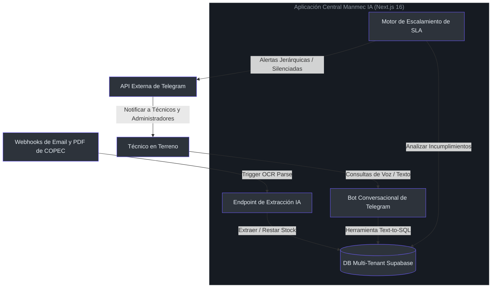

# Manmec IA — Sistema de Gestión de Mantenimiento Impulsado por IA

Bienvenido al proyecto **Manmec IA**. Esta es una cabina operativa y broker de automatización de Next.js diseñada para optimizar las operaciones de mantenimiento industrial pesado, realizar el seguimiento de los Acuerdos de Nivel de Servicio (SLA), procesar guías a través de OCR por IA y empoderar a los operadores en terreno a través de agentes conversacionales por Telegram (voz/texto).



---

## 📄 Documentación Principal del Proyecto (Índice de la Wiki)

Hemos establecido una suite de documentación completa y detallada de nivel senior dentro del directorio [doc/](file:///C:/Users/siste/Documents/Antigravity_project/manmec/doc). Explore estos recursos para dominar la arquitectura:

* 🛠️ **[00: Guía de Arquitectura de Nivel Principal](file:///C:/Users/siste/Documents/Antigravity_project/manmec/doc/00_principal_guide.md)**
  * *Filosofía de diseño de alto nivel, compromisos de arquitectura (Next.js vs pilas tradicionales), diagramas ER de dominio y flujo de datos de sistemas.*
* 🎓 **[01: Ruta de Aprendizaje: De Cero a Héroe](file:///C:/Users/siste/Documents/Antigravity_project/manmec/doc/01_zero_to_hero.md)**
  * *Hoja de ruta progresiva para nuevos desarrolladores, comparaciones tecnológicas multi-inquilino, guía de configuración local y un glosario exhaustivo de más de 40 conceptos.*
* ⚙️ **[02: Descripción General y Configuración del Entorno](file:///C:/Users/siste/Documents/Antigravity_project/manmec/doc/02_overview_setup.md)**
  * *Instrucciones paso a paso para desarrollo local, configuración de variables de entorno, topología de redes y especificaciones del clúster de producción con Docker Swarm + Traefik.*
* 🚨 **[03: Motor Proactivo de Alertas y Escalamiento de SLA](file:///C:/Users/siste/Documents/Antigravity_project/manmec/doc/03_alerts_sla_engine.md)**
  * *Funcionamiento interno del monitor cron en segundo plano, horarios de silencio adaptados a zonas horarias, filtros anti-spam y la escala jerárquica de escalamiento (Mecánico $\rightarrow$ Supervisor $\rightarrow$ Gerente $\rightarrow$ Administrador).*
* 📧 **[04: Extractor Automatizado de Webhooks de Email y PDF](file:///C:/Users/siste/Documents/Antigravity_project/manmec/doc/04_email_webhook_parser.md)**
  * *Funcionamiento detallado del webhook de ingesta de correos de COPEC, OCR multimodal con Gemini, ciclos transaccionales de apertura/cierre de OTs y descuento de stock.*
* 🤖 **[05: Bot de Telegram y Agente Conversacional Text-to-SQL](file:///C:/Users/siste/Documents/Antigravity_project/manmec/doc/05_telegram_voice_ai.md)**
  * *Guía completa sobre el enrolamiento de usuarios mediante códigos QR, procesamiento directo de archivos OGG de voz con Gemini-2.5-Flash y sandbox seguro SELECT para base de datos.*
* 🗄️ **[06: Esquema de Base de Datos y Aislamiento Multi-Tenant](file:///C:/Users/siste/Documents/Antigravity_project/manmec/doc/06_database_schema_multitenancy.md)**
  * *Análisis profundo de políticas Row Level Security (RLS), modelo ER en PostgreSQL, catálogos de uniones de inventario y límites de seguridad.*

---

## 🗂️ Estructura del Directorio de la Base de Código

```bash
manmec/
├── doc/                        # Suite de documentación de nivel senior y guías operativas
├── doc_example/                # Archivos de despliegue Docker Compose para clústeres
├── prisma/                     # Modelos Prisma y archivos de migración de base de datos
├── public/                     # Recursos visuales estáticos y logos de la aplicación
├── src/
│   ├── app/
│   │   └── api/                # Controladores de Webhooks, extracción OCR y endpoints cron
│   └── lib/
│       ├── ai/                 # Integración de Gemini, instrucciones base y sandboxes SQL
│       ├── alerts/             # Motor de SLA, lógica de horarios laborables y escalamientos
│       └── telegram/           # Enrutamiento de Telegram y módulos de mensajería externa
├── CATALOGO_TABLAS.md          # Catálogo completo de las tablas Postgres del sistema
└── PLAN_PROYECTO_MVP.md        # Plan de trabajo, prioridades y fases del MVP
```

---

## 🚀 Lanzamiento Rápido en Desarrollo Local

1. **Clonar la configuración de ejemplo**:
   ```bash
   cp .env.example .env.local
   ```
2. **Establecer claves API**: Abre `.env.local` y proporciona valores válidos para `GEMINI_API_KEY`, `SUPABASE_SERVICE_ROLE_KEY` y `TELEGRAM_API_BOT`.
3. **Poblar el esquema de base de datos**:
   ```bash
   npx prisma db push
   ```
4. **Ejecutar el servidor de desarrollo**:
   ```bash
   npm run dev
   ```

Abre [http://localhost:3000](http://localhost:3000) en tu navegador para interactuar con la cabina operativa.

---

## 🛡️ Estándar de Seguridad Multi-Tenancy

Todos los desarrolladores que contribuyan código al repositorio deben cumplir rigurosamente con las políticas de aislamiento documentadas en [doc/06_database_schema_multitenancy.md](file:///C:/Users/siste/Documents/Antigravity_project/manmec/doc/06_database_schema_multitenancy.md). Queda estrictamente prohibido omitir las políticas de RLS o las validaciones de Supabase en consultas de servidor a menos que se trate de tareas globales de analítica explícitamente autorizadas.
