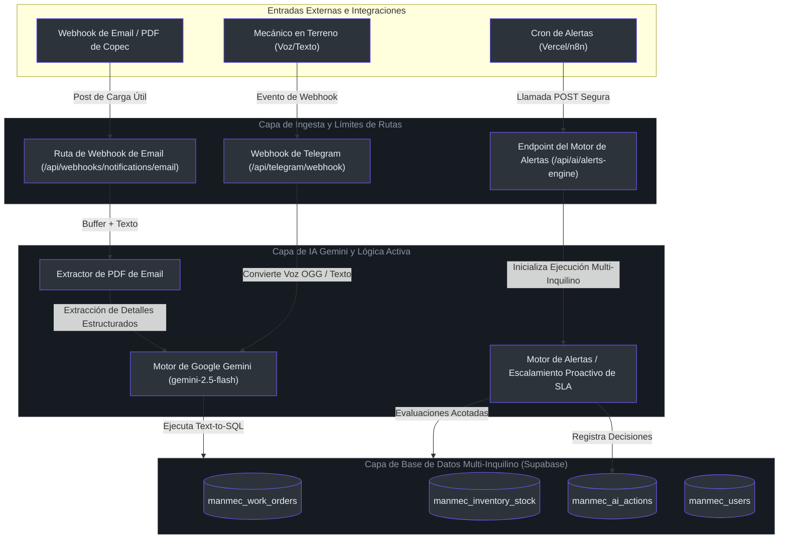
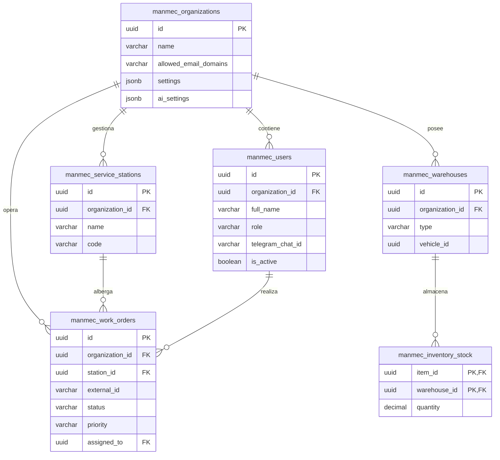

# Guía de Arquitectura de Nivel Principal

Bienvenido al equipo de ingeniería de **Manmec IA**. Esta guía proporciona una visión general densa y de opinión técnica sobre nuestros planos de arquitectura, patrones de diseño estratégico y sistemas operativos.

Manmec IA es una cabina de operaciones multi-inquilino (multi-tenant) y autónoma diseñada para el mantenimiento industrial pesado. En lugar de servir como un repositorio pasivo de datos (el típico CRUD), el sistema actúa como un agente activo que ingiere telemetría de forma continua, programa mantenimientos, hace cumplir los umbrales de SLA e interactúa con los técnicos en terreno a través de canales de voz de Telegram.

---

## 1. Perspectiva Central de la Arquitectura (El Motor Inquilino Activo)

El pilar de diseño más crítico de Manmec IA es que **todo es relativo al contexto del inquilino activo (`organization_id`)**. Bajo ninguna circunstancia las consultas o los flujos de ejecución pueden cruzar los límites de un inquilino. Incluso los motores de fondo (como notificaciones proactivas o ejecutores cron) deben ejecutarse en bloques aislados agrupados por la configuración del inquilino y sus configuraciones activas.

Para ilustrar cómo el núcleo multi-inquilino aísla, procesa e impulsa los ciclos de alerta en segundo plano, aquí se presenta el algoritmo principal traducido a **Python** (nuestro código TypeScript sigue exactamente este mismo patrón mental):

```python
# Representación conceptual en Python de nuestro bucle proactivo multi-inquilino
import asyncio
from typing import Dict, Any, List

class TenantAlertEngine:
    def __init__(self, tenant_id: str, settings: Dict[str, Any]):
        self.tenant_id = tenant_id
        self.settings = settings
        self.telegram_enabled = settings.get("alert_rules", {}).get("telegram_enabled", False)

    async def fetch_open_work_orders(self) -> List[Dict[str, Any]]:
        # Estrictamente limitado a self.tenant_id (imita a executeReadOnlyQuery en TS)
        query = f"SELECT * FROM manmec_work_orders WHERE organization_id = '{self.tenant_id}' AND status != 'COMPLETED'"
        return await db.execute_read_only(query)

    async def evaluate_sla(self, work_order: Dict[str, Any]) -> bool:
        # Evalúa los incumplimientos de SLA basados en la prioridad
        priority = work_order.get("priority")
        created_at = work_order.get("created_at")
        threshold_hours = self.settings.get("sla_thresholds", {}).get(priority, 24)
        
        elapsed_hours = (time.now() - created_at).total_seconds() / 3600
        return elapsed_hours > threshold_hours

    async def run(self):
        if not self.telegram_enabled:
            return  # El inquilino optó por no recibir alertas activas de Telegram
            
        work_orders = await self.fetch_open_work_orders()
        for wo in work_orders:
            if await self.evaluate_sla(wo):
                # Desencadena la cadena de escalamiento aislada y programa el envío
                await self.escalate(wo)

    async def escalate(self, work_order: Dict[str, Any]):
        # Lógica de escalamiento organizacional multi-nivel
        pass
```

---

## 2. Arquitectura del Sistema y Modelo de Dominio

El siguiente diagrama traza la arquitectura de nuestro sistema reactivo de alto nivel. Detalla cómo los límites de la API de Next.js reciben entradas externas, las procesan a través de la capa de datos aislada y actualizan los estados de la base de datos.

### 2.1 Contexto del Sistema y Flujos de Datos



### 2.2 Diagrama de Entidad-Relación (ER) de Dominio



---

## 3. Compromisos de Diseño (Trade-offs) y Dirección Estratégica

### 3.1 Llamadas a Funciones (Text-to-SQL) vs Endpoints de API Rígidos
* **Decisión**: Hemos diseñado el motor conversacional para depender de una herramienta de ejecución SQL de solo lectura dinámica (`executeReadOnlyQuery`) en [src/lib/ai/tools.ts](file:///C:/Users/siste/Documents/Antigravity_project/manmec/src/lib/ai/tools.ts#L21-L26) en lugar de docenas de endpoints REST separados.
* **Compromiso**: Aumenta exponencialmente la flexibilidad al permitir que la IA construya uniones complejas de múltiples tablas al vuelo. Sin embargo, requiere filtros de sanitización SQL extremadamente estrictos (permitiendo únicamente instrucciones `SELECT` y bloqueando acciones DDL/DML) para mitigar ataques de inyección de prompts.
* **Mitigación**: Aplicamos un análisis básico de palabras clave a nivel de aplicación y dependemos de un usuario Postgres de solo lectura en la capa de la base de datos (a través de la RPC de Supabase `execute_ai_query`).

### 3.2 Horas de Silencio (Quiet Hours) vs Alertas Operativas Instantáneas
* **Decisión**: Las notificaciones no críticas se encolan o se silencian por completo durante las horas no laborables o de descanso del técnico [src/lib/alerts/scheduler.ts](file:///C:/Users/siste/Documents/Antigravity_project/manmec/src/lib/alerts/scheduler.ts#L64-L81).
* **Compromiso**: Protege a los mecánicos en terreno de la fatiga por notificaciones. Sin embargo, las órdenes de trabajo críticas P1 podrían sufrir retrasos en los tiempos de respuesta si el técnico asignado está descansando.
* **Mitigación**: Implementamos un parámetro de bypass (`isCritical = true`) que fuerza la entrega inmediata para incidentes de alta prioridad, ignorando por completo los bloques de horas de silencio.

---

## 4. Orden de Lectura Sugerido para Nuevos Desarrolladores

Para integrarse rápidamente a nuestra base de código, recomendamos explorar nuestros subsistemas en la siguiente secuencia lógica:

1. **Esquema de Base de Datos y Seguridad a Nivel de Fila**: Revise [CATALOGO_TABLAS.md](file:///C:/Users/siste/Documents/Antigravity_project/manmec/CATALOGO_TABLAS.md#L14-L121) para comprender los cimientos relacionales.
2. **El Motor Proactivo**: Explore [src/lib/alerts/engine.ts](file:///C:/Users/siste/Documents/Antigravity_project/manmec/src/lib/alerts/engine.ts#L34-L130) para ver cómo se ejecutan los cálculos de fondo.
3. **Framework del Agente Conversacional**: Analice [src/lib/ai/gemini.ts](file:///C:/Users/siste/Documents/Antigravity_project/manmec/src/lib/ai/gemini.ts#L47-L146) para comprender cómo las interacciones de texto/audio se traducen en consultas a la base de datos.
4. **Operaciones del Webhook de Email**: Estudie [src/app/api/webhooks/notifications/email/route.ts](file:///C:/Users/siste/Documents/Antigravity_project/manmec/src/app/api/webhooks/notifications/email/route.ts#L19-L135) para ver el punto de entrada de nuestros flujos automatizados de terceros.

---

## 5. Referencias

* **Concepto Multi-inquilino**: [doc/arquitectura_stack.md](file:///C:/Users/siste/Documents/Antigravity_project/manmec/doc/arquitectura_stack.md#L29-L33)
* **Herramienta de Consulta SQL**: [src/lib/ai/tools.ts](file:///C:/Users/siste/Documents/Antigravity_project/manmec/src/lib/ai/tools.ts#L21-L55)
* **Enrutador de Integración de Telegram**: [src/app/api/telegram/webhook/route.ts](file:///C:/Users/siste/Documents/Antigravity_project/manmec/src/app/api/telegram/webhook/route.ts#L131-L183)
* **Ejecución del Motor de Alertas**: [src/app/api/ai/alerts-engine/route.ts](file:///C:/Users/siste/Documents/Antigravity_project/manmec/src/app/api/ai/alerts-engine/route.ts#L42-L58)
* **Lógica del Programador de Alertas**: [src/lib/alerts/scheduler.ts](file:///C:/Users/siste/Documents/Antigravity_project/manmec/src/lib/alerts/scheduler.ts#L64-L81)
