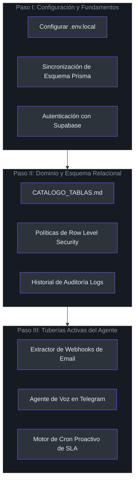
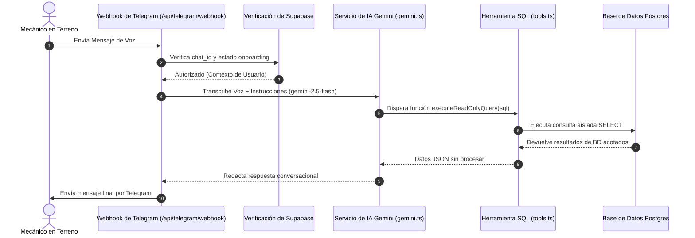

# Ruta de Aprendizaje: De Cero a Héroe

¡Bienvenido a tu camino de incorporación! Este documento te guiará progresivamente desde ser un recién llegado hasta convertirte en un desarrollador completamente productivo en el proyecto **Manmec IA**.

---

## 1. Fundamentos Tecnológicos y Comparaciones entre Lenguajes

Para ayudarte a comprender las elecciones arquitectónicas tomadas en Manmec IA, comparemos nuestra pila Next.js + TypeScript + Supabase con un entorno tradicional de Python + Django + PostgreSQL.

| Característica / Patrón | Next.js + Supabase + TS (Manmec IA) | Django + Python + PostgreSQL (Tradicional) |
| :--- | :--- | :--- |
| **Framework Backend** | Next.js 16 App Router (React Server Components) | Django REST Framework (DRF) |
| **Lenguaje y Seguridad** | TypeScript (Tipado estático, validación en compilación) | Python (Dinámico, depende de type hints y pydantic) |
| **Cumplimiento Multi-Tenant**| Políticas de Row Level Security (RLS) en PostgreSQL | Filtrado en Middleware / managers personalizados |
| **Eventos en Tiempo Real**| Supabase Realtime (WebSockets sobre CDC) | Django Channels + Redis |
| **Procesamiento de Archivos**| Rutas de API Edge + Gemini Multimodal | Celery Worker + Whisper/Tesseract OCR |
| **Integración con IA** | Llamada directa mediante SDK en la ruta de API | LangChain / Scripts personalizados en Python |

---

## 2. Hoja de Ruta Progresiva de Aprendizaje



---

## 3. Navegación por Subsistemas Clave

Nuestra base de código aprovecha las ventajas del enrutador Next.js 16 App Router. A continuación, se presenta un flujo de secuencia visual de cómo una solicitud viaja a través de la estructura del directorio:



---

## 4. Glosario de Términos (Más de 40 Conceptos Clave)

### Sistema Principal
1. **OT (Orden de Trabajo)**: Ticket a nivel de sistema que captura la solicitud de reparación y los detalles del activo [CATALOGO_TABLAS.md](file:///C:/Users/siste/Documents/Antigravity_project/manmec/CATALOGO_TABLAS.md#L7).
2. **Aviso**: El identificador externo de 8 dígitos de la Orden de Trabajo asignado por sistemas de terceros como Copec/SAP [CATALOGO_TABLAS.md](file:///C:/Users/siste/Documents/Antigravity_project/manmec/CATALOGO_TABLAS.md#L23).
3. **Inquilino (Tenant)**: Una organización empresarial aislada particionada mediante un valor único de `organization_id` [doc/arquitectura_stack.md](file:///C:/Users/siste/Documents/Antigravity_project/manmec/doc/arquitectura_stack.md#L31-L32).
4. **EESS / EDS (Estación de Servicio)**: Estaciones de servicio o centros donde operan las flotas pesadas o activos industriales [CATALOGO_TABLAS.md](file:///C:/Users/siste/Documents/Antigravity_project/manmec/CATALOGO_TABLAS.md#L8).
5. **Código SAP de Tienda (Sap Store Code)**: Cadena personalizada de 5 dígitos que identifica a las estaciones de servicio en la red de COPEC [CATALOGO_TABLAS.md](file:///C:/Users/siste/Documents/Antigravity_project/manmec/CATALOGO_TABLAS.md#L107).
6. **Mecánico Asignado**: Operador técnico principal en terreno asignado a una orden de trabajo específica [CATALOGO_TABLAS.md](file:///C:/Users/siste/Documents/Antigravity_project/manmec/CATALOGO_TABLAS.md#L26).
7. **Mecánico Líder**: El coordinador principal en un equipo de mecánicos asignado a tareas complejas [CATALOGO_TABLAS.md](file:///C:/Users/siste/Documents/Antigravity_project/manmec/CATALOGO_TABLAS.md#L43).
8. **Mecánico de Soporte**: Técnico de apoyo secundario que ayuda en las tareas de reparación en terreno [CATALOGO_TABLAS.md](file:///C:/Users/siste/Documents/Antigravity_project/manmec/CATALOGO_TABLAS.md#L43).
9. **SLA (Service Level Agreement)**: Plazo máximo permitido para resolver una orden de trabajo basado en la gravedad [src/lib/alerts/sla.ts](file:///C:/Users/siste/Documents/Antigravity_project/manmec/src/lib/alerts/sla.ts#L10-L15).
10. **Horas de Silencio (Quiet Hours)**: Períodos preconfigurados durante los cuales se silencian las alertas automatizadas del sistema [src/lib/alerts/scheduler.ts](file:///C:/Users/siste/Documents/Antigravity_project/manmec/src/lib/alerts/scheduler.ts#L9).

### Inteligencia Artificial y Procesamiento
11. **Text-to-SQL**: Capacidad de la IA de construir y ejecutar consultas de base de datos en tiempo real basadas en lenguaje natural [src/lib/ai/tools.ts](file:///C:/Users/siste/Documents/Antigravity_project/manmec/src/lib/ai/tools.ts#L21-L26).
12. **Procesamiento de Audio Nativo**: Habilidad de Gemini para analizar archivos OGG de voz directamente sin requerir capas intermedias de transcripción [src/lib/ai/gemini.ts](file:///C:/Users/siste/Documents/Antigravity_project/manmec/src/lib/ai/gemini.ts#L54-L58).
13. **Modelo Multimodal de Visión**: Modelos de Gemini-Flash utilizados para analizar imágenes y PDFs adjuntos [src/lib/ai/gemini.ts](file:///C:/Users/siste/Documents/Antigravity_project/manmec/src/lib/ai/gemini.ts#L18).
14. **Extractor OCR de PDFs**: Utilidades que se ejecutan en Next.js para compilar matrices de texto desde documentos digitales [src/lib/ai/email-parser.ts](file:///C:/Users/siste/Documents/Antigravity_project/manmec/src/lib/ai/email-parser.ts#L56-L79).
15. **Instrucciones del Sistema (System Prompt)**: Conjunto de instrucciones que delimita las respuestas de la IA a las operaciones específicas de Manmec [src/lib/ai/gemini.ts](file:///C:/Users/siste/Documents/Antigravity_project/manmec/src/lib/ai/gemini.ts#L62-L65).
16. **Llamadas a Funciones (Tools)**: Herramientas programáticas disponibles que Gemini puede invocar para interactuar con el entorno [src/lib/ai/gemini.ts](file:///C:/Users/siste/Documents/Antigravity_project/manmec/src/lib/ai/gemini.ts#L23-L42).
17. **Matriz de Modelos (Model Matrix)**: Configuración que especifica qué modelo especializado utilizar según la tarea [src/lib/ai/gemini.ts](file:///C:/Users/siste/Documents/Antigravity_project/manmec/src/lib/ai/gemini.ts#L53-L56).
18. **Tipo de Acción (Action Type)**: Clasificación del evento registrado en las alertas automáticas [src/lib/telegram/sender.ts](file:///C:/Users/siste/Documents/Antigravity_project/manmec/src/lib/telegram/sender.ts#L6).
19. **Sandbox SQL de IA**: Filtros de seguridad a nivel de aplicación que limitan las consultas generadas estrictamente a comandos SELECT [src/lib/ai/tools.ts](file:///C:/Users/siste/Documents/Antigravity_project/manmec/src/lib/ai/tools.ts#L23-L34).
20. **Motor de Logs de Auditoría**: Sistema de seguimiento global que registra las consultas de Gemini y las acciones de automatización en base de datos [src/app/api/webhooks/notifications/email/route.ts](file:///C:/Users/siste/Documents/Antigravity_project/manmec/src/app/api/webhooks/notifications/email/route.ts#L403-L415).

### Inventario y Logística
21. **SKU (Stock Keeping Unit)**: Identificador único de catálogo asignado a cada repuesto o pieza física [CATALOGO_TABLAS.md](file:///C:/Users/siste/Documents/Antigravity_project/manmec/CATALOGO_TABLAS.md#L9).
22. **Bodega Fija**: Almacén físico principal en terreno o bodegas centrales de distribución [CATALOGO_TABLAS.md](file:///C:/Users/siste/Documents/Antigravity_project/manmec/CATALOGO_TABLAS.md#L76).
23. **Bodega Móvil**: Furgón, camioneta o vehículo de asistencia equipado con un kit de repuestos [CATALOGO_TABLAS.md](file:///C:/Users/siste/Documents/Antigravity_project/manmec/CATALOGO_TABLAS.md#L76).
24. **Deducción de Material**: El proceso automático de restar del inventario los materiales consumidos cuando se cierra una orden de trabajo [src/app/api/webhooks/notifications/email/route.ts](file:///C:/Users/siste/Documents/Antigravity_project/manmec/src/app/api/webhooks/notifications/email/route.ts#L301-L320).
25. **Transacción de Entrega Manual (Handshake)**: Transferencia física controlada de inventario entre dos técnicos en ruta [doc/arquitectura_stack.md](file:///C:/Users/siste/Documents/Antigravity_project/manmec/doc/arquitectura_stack.md#L43-L44).
26. **Pre-aviso de Despacho (Pre-Advised)**: Alertas ingresadas a partir de guías de despacho pendientes de recepción [src/app/api/webhooks/notifications/email/route.ts](file:///C:/Users/siste/Documents/Antigravity_project/manmec/src/app/api/webhooks/notifications/email/route.ts#L380-L390).
27. **Conteo Físico (Stock Count)**: Cantidad real actual registrada en inventario para un SKU específico [CATALOGO_TABLAS.md](file:///C:/Users/siste/Documents/Antigravity_project/manmec/CATALOGO_TABLAS.md#L86).
28. **ID de Vehículo (Vehicle ID)**: Código único que enlaza una bodega móvil con una patente de camión o camioneta [CATALOGO_TABLAS.md](file:///C:/Users/siste/Documents/Antigravity_project/manmec/CATALOGO_TABLAS.md#L77).
29. **Umbral de Reorden**: Cantidad mínima permitida antes de que se requiera la compra automática de nuevos repuestos (Verificar esquema Prisma).
30. **Historial de Movimientos**: Historial inmutable que registra las transferencias e ingresos de inventario [src/app/api/webhooks/notifications/email/route.ts](file:///C:/Users/siste/Documents/Antigravity_project/manmec/src/app/api/webhooks/notifications/email/route.ts#L340-L347).

### Bot de Telegram y Comunicaciones
31. **Registro por Código QR**: Flujo de seguridad que emplea hashes temporales para vincular cuentas de Telegram [src/app/api/telegram/webhook/route.ts](file:///C:/Users/siste/Documents/Antigravity_project/manmec/src/app/api/telegram/webhook/route.ts#L36-L58).
32. **Handshake de Contacto**: Paso de seguridad donde el usuario comparte su tarjeta telefónica para validar su identidad en base de datos [src/app/api/telegram/webhook/route.ts](file:///C:/Users/siste/Documents/Antigravity_project/manmec/src/app/api/telegram/webhook/route.ts#L75-L123).
33. **Estado de Onboarding (onboarding_status)**: Estado de verificación del usuario que indica si ha completado el enrolamiento [src/app/api/telegram/webhook/route.ts](file:///C:/Users/siste/Documents/Antigravity_project/manmec/src/app/api/telegram/webhook/route.ts#L93).
34. **Notificaciones de Respaldo**: Registro de avisos en paneles web cuando los mensajes por Telegram fallan [src/lib/telegram/sender.ts](file:///C:/Users/siste/Documents/Antigravity_project/manmec/src/lib/telegram/sender.ts#L95-L117).
35. **Chat ID**: Código asignado por Telegram que identifica de forma única la ventana de chat del técnico [src/app/api/telegram/webhook/route.ts](file:///C:/Users/siste/Documents/Antigravity_project/manmec/src/app/api/telegram/webhook/route.ts#L24).
36. **Token Temporal**: Código alfanumérico con expiración de 10 minutos utilizado en el enrolamiento seguro [src/app/api/telegram/webhook/route.ts](file:///C:/Users/siste/Documents/Antigravity_project/manmec/src/app/api/telegram/webhook/route.ts#L55).
37. **Límite de Envío Telegram (429)**: Restricciones de tráfico impuestas por Telegram que requieren reintentos exponenciales [src/lib/telegram/sender.ts](file:///C:/Users/siste/Documents/Antigravity_project/manmec/src/lib/telegram/sender.ts#L61-L68).
38. **Parse Mode**: Especificación de formato de envío en las llamadas a la API de Telegram (Markdown o HTML) [src/lib/telegram/sender.ts](file:///C:/Users/siste/Documents/Antigravity_project/manmec/src/lib/telegram/sender.ts#L36-L55).
39. **Acción Conversacional de Escritura**: Actores visuales que muestran en Telegram "escribiendo..." mientras la IA procesa [src/app/api/telegram/webhook/route.ts](file:///C:/Users/siste/Documents/Antigravity_project/manmec/src/app/api/telegram/webhook/route.ts#L149).
40. **Mime OGG de Audio**: Formato de compresión nativo empleado en los mensajes de voz enviados por Telegram [src/lib/ai/gemini.ts](file:///C:/Users/siste/Documents/Antigravity_project/manmec/src/lib/ai/gemini.ts#L84).

---

## 5. Configuración del Desarrollo y Contribución

1. **Copiar la configuración de desarrollo local**:
   ```bash
   cp .env.example .env.local
   ```
2. **Configurar las variables de entorno**: Proporcionar valores válidos para `NEXT_PUBLIC_SUPABASE_URL`, `SUPABASE_SERVICE_ROLE_KEY` y `GEMINI_API_KEY`.
3. **Sincronizar el esquema con base de datos**:
   ```bash
   npx prisma db push
   ```
4. **Ejecutar el servidor local de desarrollo**:
   ```bash
   npm run dev
   ```

---

## 6. Referencias

* **Definición de Subsistemas**: [doc/arquitectura_stack.md](file:///C:/Users/siste/Documents/Antigravity_project/manmec/doc/arquitectura_stack.md#L15-L28)
* **Catálogo de Tablas**: [CATALOGO_TABLAS.md](file:///C:/Users/siste/Documents/Antigravity_project/manmec/CATALOGO_TABLAS.md#L14-L121)
* **Enrolamiento en Telegram**: [src/app/api/telegram/webhook/route.ts](file:///C:/Users/siste/Documents/Antigravity_project/manmec/src/app/api/telegram/webhook/route.ts#L36-L128)
* **Cálculo de SLA**: [src/lib/alerts/sla.ts](file:///C:/Users/siste/Documents/Antigravity_project/manmec/src/lib/alerts/sla.ts#L10-L15)
* **Deducción de Inventario**: [src/app/api/webhooks/notifications/email/route.ts](file:///C:/Users/siste/Documents/Antigravity_project/manmec/src/app/api/webhooks/notifications/email/route.ts#L301-L359)
