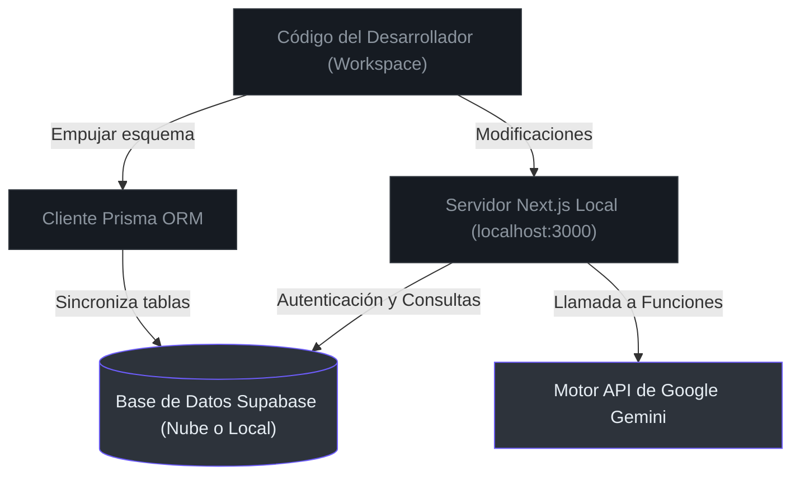
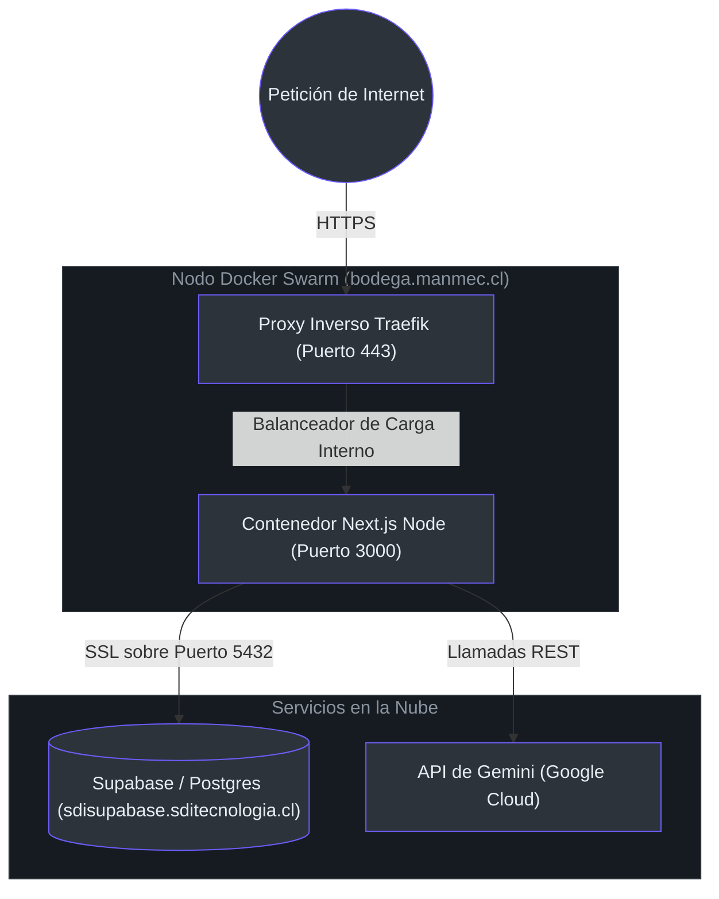

# Descripción General y Configuración del Entorno de Desarrollo

Esta guía te ayudará a configurar tu entorno local de desarrollo para **Manmec IA** y te explicará la arquitectura de configuración para despliegues en entornos de pruebas (staging) y producción.

---

## 1. Dependencias del Sistema y Variables de Entorno

Manmec IA requiere tres integraciones clave para funcionar:
1. **Supabase**: Base de datos multi-inquilino en tiempo real y autenticación [doc/arquitectura_stack.md](file:///C:/Users/siste/Documents/Antigravity_project/manmec/doc/arquitectura_stack.md#L15-L21).
2. **Google Gemini**: Modelos de lenguaje grande y procesamiento de voz multimodal [src/lib/ai/gemini.ts](file:///C:/Users/siste/Documents/Antigravity_project/manmec/src/lib/ai/gemini.ts#L6-L16).
3. **API de Bots de Telegram**: Canal de comunicación conversacional y enrolamiento seguro por códigos QR [src/app/api/telegram/webhook/route.ts](file:///C:/Users/siste/Documents/Antigravity_project/manmec/src/app/api/telegram/webhook/route.ts#L36-L73).

### Configuración del archivo de variables (`.env.local`)

```ini
# Configuración de Supabase
NEXT_PUBLIC_SUPABASE_URL=https://tu-proyecto.supabase.co
NEXT_PUBLIC_SUPABASE_ANON_KEY=eyJhbGciOiJI...
SUPABASE_SERVICE_ROLE_KEY=eyJhbGciOiJIUz...

# Clave API de Google Gemini
GEMINI_API_KEY=AIzaSy...

# Integración con Telegram
TELEGRAM_API_BOT=123456789:ABCdefGhIJK...

# Claves de Seguridad
CRON_SECRET=clave_segura_cron_aqui
```

---

## 2. Diagramas de Topología del Sistema

### 2.1 Ciclo de Vida del Desarrollo Local



### 2.2 Topología de Producción (Docker Swarm + Traefik)



---

## 3. Configuración de Referencia para Producción (Stack YAML)

La siguiente tabla resume las configuraciones operativas de contenedores derivadas de nuestro archivo de despliegue [doc_example/manmec.yaml](file:///C:/Users/siste/Documents/Antigravity_project/manmec/doc_example/manmec.yaml#L1-L44):

| Parámetro | Valor de Producción | Propósito Operativo |
| :--- | :--- | :--- |
| **Origen de Imagen** | `ghcr.io/veteranoql69/manmec.ia:latest` | Registro automatizado de despliegue de Docker [doc_example/manmec.yaml](file:///C:/Users/siste/Documents/Antigravity_project/manmec/doc_example/manmec.yaml#L3). |
| **Dominio Anfitrión** | `bodega.manmec.cl` | Dominio enrutado para la interfaz pública [doc_example/manmec.yaml](file:///C:/Users/siste/Documents/Antigravity_project/manmec/doc_example/manmec.yaml#L32). |
| **Puerto Proxy** | `3000` | Puerto expuesto internamente por el contenedor [doc_example/manmec.yaml](file:///C:/Users/siste/Documents/Antigravity_project/manmec/doc_example/manmec.yaml#L37). |
| **Límite de CPU** | `1` | Cuotas de procesador configuradas en Swarm [doc_example/manmec.yaml](file:///C:/Users/siste/Documents/Antigravity_project/manmec/doc_example/manmec.yaml#L27). |
| **Límite de Memoria**| `1024M` | Memoria máxima asignada al contenedor [doc_example/manmec.yaml](file:///C:/Users/siste/Documents/Antigravity_project/manmec/doc_example/manmec.yaml#L28). |
| **Red de Redes** | `sdinet` (External) | Conexión de redes a nivel del nodo Swarm [doc_example/manmec.yaml](file:///C:/Users/siste/Documents/Antigravity_project/manmec/doc_example/manmec.yaml#L41-L43). |

---

## 4. Resolución de Problemas en el Desarrollo Local

### error: `GEMINI_API_KEY` falta en `process.env`
* **Síntoma**: Error en la consola del servidor: `CRITICAL: GEMINI_API_KEY is missing in process.env` [src/lib/ai/gemini.ts](file:///C:/Users/siste/Documents/Antigravity_project/manmec/src/lib/ai/gemini.ts#L10-L12).
* **Solución**: Asegúrate de que el archivo `.env.local` exista en el directorio raíz de tu espacio de trabajo y sea cargado correctamente por Next.js. Reinicia el servidor local tras realizar cambios.

### error: Fallo en la validación compartida de contacto de Telegram
* **Síntoma**: El usuario en Telegram recibe: `🚫 Error de Seguridad` [src/app/api/telegram/webhook/route.ts](file:///C:/Users/siste/Documents/Antigravity_project/manmec/src/app/api/telegram/webhook/route.ts#L118-L122).
* **Solución**: Comprueba que el número de teléfono registrado en `manmec_users` coincida exactamente en formato y caracteres con el perfil real de Telegram/WhatsApp del técnico [src/app/api/telegram/webhook/route.ts](file:///C:/Users/siste/Documents/Antigravity_project/manmec/src/app/api/telegram/webhook/route.ts#L76-L89).

---

## 5. Referencias

* **Definición del Stack**: [doc/arquitectura_stack.md](file:///C:/Users/siste/Documents/Antigravity_project/manmec/doc/arquitectura_stack.md#L5-L21)
* **Especificaciones del Nodo Swarm**: [doc_example/manmec.yaml](file:///C:/Users/siste/Documents/Antigravity_project/manmec/doc_example/manmec.yaml#L1-L45)
* **Inicializador del Cliente Supabase**: [src/lib/ai/tools.ts](file:///C:/Users/siste/Documents/Antigravity_project/manmec/src/lib/ai/tools.ts#L6-L15)
* **Inicializador del Cliente Gemini**: [src/lib/ai/gemini.ts](file:///C:/Users/siste/Documents/Antigravity_project/manmec/src/lib/ai/gemini.ts#L6-L16)
* **Paso de Verificación de Enrolamiento**: [src/app/api/telegram/webhook/route.ts](file:///C:/Users/siste/Documents/Antigravity_project/manmec/src/app/api/telegram/webhook/route.ts#L75-L127)
