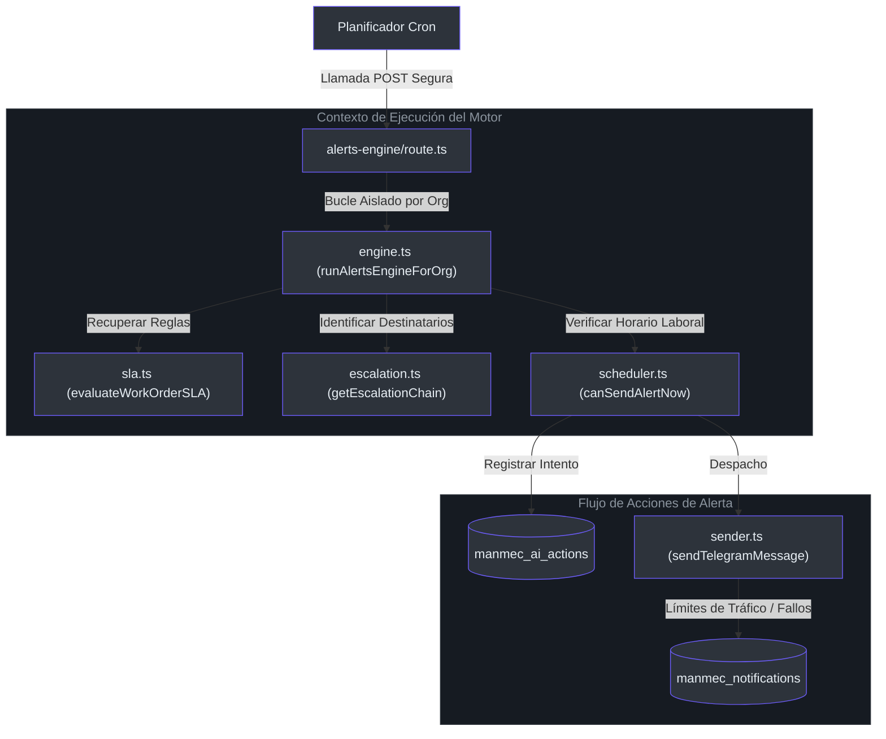
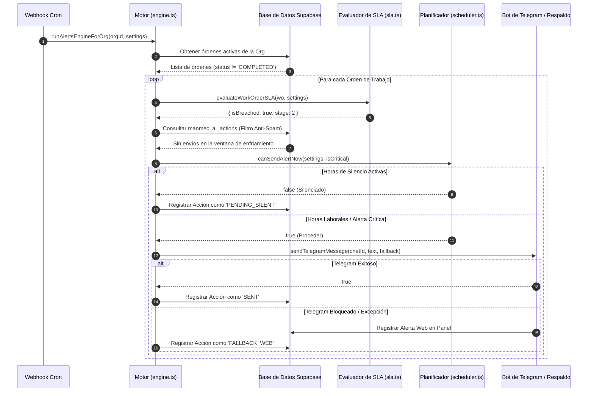

# Motor Proactivo de Alertas y Escalamiento de SLA

El **Motor de Alertas Proactivas y Escalamiento de SLA** es el núcleo operativo que impulsa la acción en Manmec IA. Su propósito es monitorear activamente las tareas de mantenimiento pendientes, evaluarlas en comparación con los SLA específicos de la organización, programar notificaciones oportunas y escalar automáticamente los problemas no resueltos a través de la jerarquía corporativa.

---

## 1. Arquitectura del Subsistema y Componentes

El motor se activa externamente mediante una ruta POST en [src/app/api/ai/alerts-engine/route.ts](file:///C:/Users/siste/Documents/Antigravity_project/manmec/src/app/api/ai/alerts-engine/route.ts#L7-L14) (generalmente invocada de forma periódica por un cron automatizado). Este endpoint recupera los inquilinos activos, revisa sus configuraciones individuales y ejecuta el motor en procesos aislados y paralelos.



---

## 2. Evaluación Dinámica de SLA y Filtro Anti-Spam

Para cada Orden de Trabajo (`manmec_work_orders`) activa, el sistema calcula los plazos de vencimiento y las rutas de escalamiento correspondientes [src/lib/alerts/sla.ts](file:///C:/Users/siste/Documents/Antigravity_project/manmec/src/lib/alerts/sla.ts#L33-L73):

1. **Selección de Reglas**: El sistema lee los umbrales de SLA configurados de forma personalizada en `organization.settings` (por ejemplo, `P1 = 2 horas`, `P2 = 12 horas`, `P3 = 24 horas`).
2. **Cálculo del Incumplimiento**: Se compara el tiempo transcurrido desde la creación del ticket (`wo.created_at`) con el umbral aplicable.
3. **Determinación del Nivel de Escalamiento**: La duración del retraso define a quién se le envía la notificación. A medida que pasa el tiempo sin resolución, la alerta avanza desde el Nivel 1 (Técnico asignado) hasta el Nivel 4 (Administrador de la Compañía).
4. **Filtro Anti-Spam (Verificación de historial)**: Antes de enviar cualquier alerta, el sistema consulta la tabla `manmec_ai_actions` [src/lib/alerts/engine.ts](file:///C:/Users/siste/Documents/Antigravity_project/manmec/src/lib/alerts/engine.ts#L106-L122). Si se envió una alerta idéntica recientemente dentro de la ventana de enfriamiento configurada (por ejemplo, 2 horas), la alerta se bloquea para evitar la saturación del destinatario.



---

## 3. Horas de Silencio y Horarios Adaptados a Zonas Horarias

El sistema soporta configuraciones de horarios adaptadas a la zona horaria del inquilino. El motor respeta los horarios definidos y silencia los envíos automáticos fuera de estas horas, a menos que el incidente sea crítico [src/lib/alerts/scheduler.ts](file:///C:/Users/siste/Documents/Antigravity_project/manmec/src/lib/alerts/scheduler.ts#L64-L81).

### Lógica del Programador en src/lib/alerts/scheduler.ts

```typescript
// Pseudocódigo simplificado de nuestra validación en src/lib/alerts/scheduler.ts
export function canSendAlertNow(config: SchedulerOrgConfig, isCritical: boolean = false): boolean {
    if (isCritical) return true; // Las alertas críticas omiten las horas de silencio por completo

    const currentTime = getHHMMInTimezone(config.timezone);

    // 1. Si está dentro de las horas de silencio (silence_hours), se rechaza
    if (config.silence_hours && isTimeInRange(currentTime, config.silence_hours)) {
        return false;
    }

    // 2. Si se definen horas laborables, debemos estar dentro de ellas
    if (config.working_hours) {
        return isTimeInRange(currentTime, config.working_hours);
    }

    return true; // Envíos inmediatos por defecto
}
```

---

## 4. Jerarquía Organizacional de Escalamiento

Si un incidente en terreno supera los umbrales de SLA permitidos sin recibir solución, el motor busca la estructura de personal jerárquico configurada para ese técnico específico dentro del inquilino [src/lib/alerts/escalation.ts](file:///C:/Users/siste/Documents/Antigravity_project/manmec/src/lib/alerts/escalation.ts#L16-L23):

* **Nivel 1 (Técnico)**: Se envía un recordatorio directo por Telegram al mecánico asignado (`wo.assigned_to`) para advertir del retraso [src/lib/alerts/escalation.ts](file:///C:/Users/siste/Documents/Antigravity_project/manmec/src/lib/alerts/escalation.ts#L31-L41).
* **Nivel 2 (Supervisor Directo)**: Si el problema persiste, el supervisor asignado a ese mecánico en `manmec_supervisor_assignments` se integra al canal de alertas [src/lib/alerts/escalation.ts](file:///C:/Users/siste/Documents/Antigravity_project/manmec/src/lib/alerts/escalation.ts#L42-L59).
* **Nivel 3 (Gerentes de Operaciones)**: Las alertas no resueltas escalan automáticamente a todas las cuentas con rol `MANAGER` vinculadas al inquilino [src/lib/alerts/escalation.ts](file:///C:/Users/siste/Documents/Antigravity_project/manmec/src/lib/alerts/escalation.ts#L62-L70).
* **Nivel 4 (Administradores de la Empresa)**: Como último paso de contención, el sistema notifica a los perfiles `COMPANY_ADMIN`, catalogando la situación como emergencia operativa de prioridad máxima [src/lib/alerts/escalation.ts](file:///C:/Users/siste/Documents/Antigravity_project/manmec/src/lib/alerts/escalation.ts#L72-L80).

---

## 5. Estructura de Tablas del Subsistema

Para auditar el historial y prevenir envíos repetidos, el motor utiliza la siguiente estructura relacional en PostgreSQL [CATALOGO_TABLAS.md](file:///C:/Users/siste/Documents/Antigravity_project/manmec/CATALOGO_TABLAS.md#L35-L56):

### `manmec_ai_actions` (Historial de Alertas y Acciones)
* **`id`** (UUID, PK): Código único del registro de envío.
* **`organization_id`** (UUID, FK): Enlaza el registro con el inquilino específico.
* **`work_order_id`** (UUID, FK): Referencia a la orden de trabajo incumplida.
* **`action_type`** (VARCHAR): Categoría del evento (por ejemplo, `SLA_BREACH_ALERT`).
* **`status`** (VARCHAR): Estado final del despacho (`SENT`, `PENDING_SILENT`, `FAILED`, `FALLBACK_WEB`).
* **`target_user_id`** (UUID, FK): El destinatario al que se programó enviar el mensaje.
* **`sent_at`** (TIMESTAMPTZ): Registro de la fecha y hora de despacho.

---

## 6. Referencias

* **Entrada del Webhook Cron**: [src/app/api/ai/alerts-engine/route.ts](file:///C:/Users/siste/Documents/Antigravity_project/manmec/src/app/api/ai/alerts-engine/route.ts#L18-L46)
* **Tubería Central del Motor**: [src/lib/alerts/engine.ts](file:///C:/Users/siste/Documents/Antigravity_project/manmec/src/lib/alerts/engine.ts#L34-L130)
* **Cálculo de Plazos de Incumplimiento**: [src/lib/alerts/sla.ts](file:///C:/Users/siste/Documents/Antigravity_project/manmec/src/lib/alerts/sla.ts#L33-L73)
* **Jerarquía del Personal de Soporte**: [src/lib/alerts/escalation.ts](file:///C:/Users/siste/Documents/Antigravity_project/manmec/src/lib/alerts/escalation.ts#L16-L82)
* **Cálculos de Zonas Horarias**: [src/lib/alerts/scheduler.ts](file:///C:/Users/siste/Documents/Antigravity_project/manmec/src/lib/alerts/scheduler.ts#L64-L81)
* **Canal de Despacho de Telegram**: [src/lib/telegram/sender.ts](file:///C:/Users/siste/Documents/Antigravity_project/manmec/src/lib/telegram/sender.ts#L15-L93)
