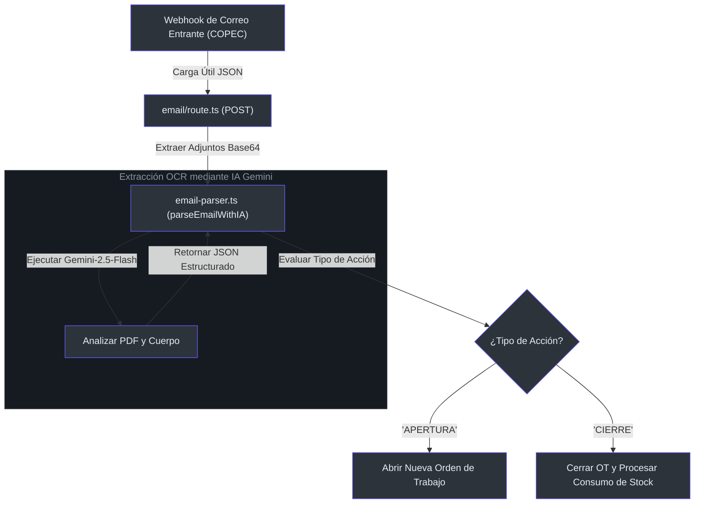

# Extractor Automatizado de Webhooks de Email y PDF

El **Extractor Automatizado de Email y Archivos PDF** vincula de forma dinámica los flujos operativos externos con nuestra base de datos relacional. Cuando se reciben correos de mantenimiento (como notificaciones u órdenes de trabajo de COPEC), nuestro sistema analiza el texto del cuerpo y los archivos PDF adjuntos mediante IA para abrir o cerrar de forma automática órdenes de trabajo y actualizar los niveles de inventario sin intervención humana.

---

## 1. Flujo del Webhook y Tubería de Ingesta

El sistema expone un endpoint seguro que recibe cargas útiles (payloads) de correos electrónicos en [src/app/api/webhooks/notifications/email/route.ts](file:///C:/Users/siste/Documents/Antigravity_project/manmec/src/app/api/webhooks/notifications/email/route.ts#L36-L54). Estas peticiones contienen las cabeceras estructuradas del correo, el cuerpo en formato HTML o texto y los documentos adjuntos codificados en base64.



---

## 2. Extracción de Datos mediante Gemini Flash

El motor de extracción de datos depende de las capacidades multimodales del modelo `gemini-2.5-flash` para interpretar archivos adjuntos independientemente de la distribución visual o maquetación del documento original [src/lib/ai/email-parser.ts](file:///C:/Users/siste/Documents/Antigravity_project/manmec/src/lib/ai/email-parser.ts#L51-L86).

### 2.1 Mecanismo de Procesamiento de PDF
Cuando procesa adjuntos PDF, el sistema primero ejecuta un análisis directo de caracteres empleando clases auxiliares internas [src/lib/ai/email-parser.ts](file:///C:/Users/siste/Documents/Antigravity_project/manmec/src/lib/ai/email-parser.ts#L56-L65). Si el documento no posee capas vectoriales de texto o los datos resultantes son insuficientes, el motor activa automáticamente el procesamiento visual del documento.

La IA está programada para responder bajo un esquema estructurado estricto [src/lib/ai/email-parser.ts](file:///C:/Users/siste/Documents/Antigravity_project/manmec/src/lib/ai/email-parser.ts#L88-L125):
```typescript
interface ParseResult {
  actionType: "APERTURA" | "CIERRE" | "PRE_ADVISO";
  aviso: string;            // El identificador de 8 dígitos de COPEC
  estacionServicio: string; // Nombre o cadena de la EESS
  sapStoreCode: string;     // Código SAP de 5 dígitos de la estación
  consumedMaterials: Array<{
    sku: string;            // Código del repuesto
    quantity: number;       // Cantidad consumida
    warehouseId?: string;   // Opcional: Bodega móvil o fija específica
  }>;
}
```

---

## 3. Flujo de Estados y Transiciones de la Orden de Trabajo

Una vez analizada la estructura, se inician transacciones en base de datos bajo límites aislados [src/app/api/webhooks/notifications/email/route.ts](file:///C:/Users/siste/Documents/Antigravity_project/manmec/src/app/api/webhooks/notifications/email/route.ts#L106-L230):

```mermaid
stateDiagram-v2
    classDef default fill:#2d333b,stroke:#6d5dfc,color:#e6edf3;
    
    [*] --> Ingesta : Recibir Carga Útil del Webhook
    Ingesta --> Gemini_OCR : Extracción de Datos con IA
    
    state Gemini_OCR {
        [*] --> Analizar_Adjuntos
        Analizar_Adjuntos --> Generar_JSON
    }

    Generar_JSON --> Router_Eval : Evaluar Tipo de Acción
    
    state Router_Eval {
        state "Flujo de Apertura" as Ap {
            Check_Exists_Open --> Crear_OT : Aviso nuevo
            Check_Exists_Open --> Omitir_Open : Aviso ya existe y está activo
        }
        state "Flujo de Cierre" as Ci {
            Buscar_OT_Cierre --> Actualizar_Estado : Marcar como COMPLETADO
            Actualizar_Estado --> Deduccion_Stock : Restar Repuestos
            Deduccion_Stock --> Registro_Auditoria : Registrar Logs Operativos
        }
    }

    Router_Eval --> [*] : Transacción Finalizada
```

---

## 4. Lógica de Deducción de Stock en Bodegas

Al recibir un evento de cierre (`CIERRE`), el sistema inicia la conciliación automática de repuestos consumidos en las reparaciones en terreno [src/app/api/webhooks/notifications/email/route.ts](file:///C:/Users/siste/Documents/Antigravity_project/manmec/src/app/api/webhooks/notifications/email/route.ts#L301-L364):

1. **Ubicación de la Bodega de Origen**:
   * Si el parser extrae una bodega específica (`warehouseId`), se deduce stock directamente de ese almacén.
   * En su defecto, se realiza una búsqueda de la **Bodega Móvil** (camioneta o furgón) asignada al mecánico líder a cargo de la orden de trabajo.
2. **Coincidencia de SKU**: El sistema verifica si el repuesto (SKU) se encuentra catalogado en el almacén de destino.
3. **Registro de Movimiento**: Para cada repuesto restado, el sistema:
   * Disminuye la cantidad en `stock_count` dentro de `manmec_warehouse_items` [src/app/api/webhooks/notifications/email/route.ts](file:///C:/Users/siste/Documents/Antigravity_project/manmec/src/app/api/webhooks/notifications/email/route.ts#L318-L325).
   * Inserta un registro inmutable en `manmec_inventory_movements` detallando la transacción de salida [src/app/api/webhooks/notifications/email/route.ts](file:///C:/Users/siste/Documents/Antigravity_project/manmec/src/app/api/webhooks/notifications/email/route.ts#L340-L347).

---

## 5. Sistema de Notificaciones Automáticas

Tras procesar un evento, el sistema genera notificaciones en tiempo real para los supervisores y administradores de la organización. Hay dos mecanismos complementarios:

**Trigger de BD (descuentos de stock):** La migración `015_stock_deduction_notifications.sql` instala el trigger `manmec_trg_stock_deduction_notification` que se dispara en cada INSERT de tipo `OUT` en `manmec_inventory_movements`. Inserta una fila en `manmec_notifications` por cada usuario con rol `SUPERVISOR`, `MANAGER` o `COMPANY_ADMIN` de la organización, incluyendo en el `payload` JSONB: nombre del repuesto, cantidad, bodega, estación y código OT.

**`createOrgNotification()` (eventos de nivel aplicación):** Para eventos que no pasan por la tabla de movimientos (ej: recepción de guías de despacho), el servidor llama directamente a `src/lib/notifications/create.ts`. Acepta `target_roles` para segmentar destinatarios.

Las notificaciones llegan al cliente en tiempo real vía **Supabase Realtime** (Postgres Changes), sin polling. El componente `NotificationBell` suscribe al canal `notif-bell-{userId}` filtrando por `user_id`.

---

## 6. Auditoría de Procesos de Automatización

Cada acción ejecutada por el webhook es auditada exhaustivamente en la tabla `manmec_ia_automation_logs` [src/app/api/webhooks/notifications/email/route.ts](file:///C:/Users/siste/Documents/Antigravity_project/manmec/src/app/api/webhooks/notifications/email/route.ts#L403-L417). Este registro inalterable incluye:
* Marca de tiempo de la invocación.
* Contenido completo del correo original.
* JSON estructurado devuelto por la IA.
* Resultados finales de la ejecución (`SUCCESS`, `PARTIAL_FAILED`, `FAILED`).
* Referencias a los cambios concretos aplicados en base de datos.

---

## 6. Referencias

* **Controlador del Endpoint POST**: [src/app/api/webhooks/notifications/email/route.ts](file:///C:/Users/siste/Documents/Antigravity_project/manmec/src/app/api/webhooks/notifications/email/route.ts#L36-L54)
* **Lógica del Parser Gemini**: [src/lib/ai/email-parser.ts](file:///C:/Users/siste/Documents/Antigravity_project/manmec/src/lib/ai/email-parser.ts#L51-L86)
* **Transacción de Creación de OT**: [src/app/api/webhooks/notifications/email/route.ts](file:///C:/Users/siste/Documents/Antigravity_project/manmec/src/app/api/webhooks/notifications/email/route.ts#L106-L162)
* **Descuento de Stock en Bodegas**: [src/app/api/webhooks/notifications/email/route.ts](file:///C:/Users/siste/Documents/Antigravity_project/manmec/src/app/api/webhooks/notifications/email/route.ts#L301-L364)
* **Historial de Movimientos de Inventario**: [src/app/api/webhooks/notifications/email/route.ts](file:///C:/Users/siste/Documents/Antigravity_project/manmec/src/app/api/webhooks/notifications/email/route.ts#L340-L347)
