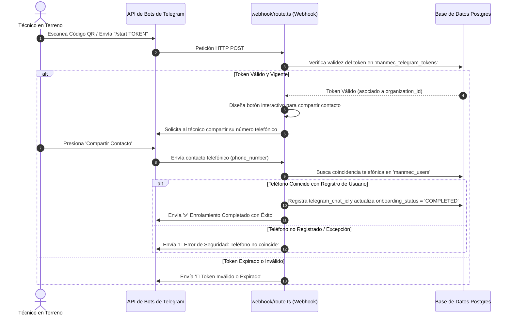
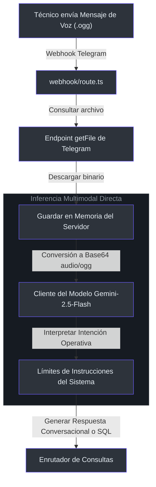

# Bot de Telegram y Agente Conversacional Text-to-SQL

El **Bot de Telegram y Agente Conversacional** permite a los técnicos en terreno y supervisores de operaciones realizar consultas directas y conversar con la base de datos en lenguaje natural utilizando texto o mensajes de voz.

---

## 1. Flujo de Enrolamiento y Autenticación Seguro

Para garantizar una estricta seguridad en los accesos y aislar los datos de los inquilinos, el sistema implementa un enrolamiento obligatorio en dos etapas [src/app/api/telegram/webhook/route.ts](file:///C:/Users/siste/Documents/Antigravity_project/manmec/src/app/api/telegram/webhook/route.ts#L36-L128).



---

## 2. Ingesta de Audio (Procesamiento de Archivos OGG sin Transcriptores)

Cuando un técnico envía un mensaje de voz, el webhook descarga el archivo de audio `.ogg` desde los servidores de Telegram y lo transmite directamente codificado en base64 al cliente de Gemini, evitando así la latencia asociada a motores tradicionales de transcripción de voz a texto [src/lib/ai/gemini.ts](file:///C:/Users/siste/Documents/Antigravity_project/manmec/src/lib/ai/gemini.ts#L75-L101).



* **Cero Latencia de Transcripción**: Al alimentar a `gemini-2.5-flash` con flujos nativos de audio en formato OGG, el agente captura detalles del tono y modulación de la voz, mejorando la precisión en la interpretación del lenguaje y modismos técnicos chilenos.

---

## 3. Consultas en Lenguaje Natural Seguras (Text-to-SQL de Solo Lectura)

Cuando un usuario solicita datos de operaciones (como stock de repuestos o estados de órdenes), la IA recurre a la herramienta `executeReadOnlyQuery` para consultar directamente la base de datos [src/lib/ai/tools.ts](file:///C:/Users/siste/Documents/Antigravity_project/manmec/src/lib/ai/tools.ts#L21-L36).

Para garantizar la seguridad de la información y prevenir la alteración de datos, el sandbox de Text-to-SQL aplica las siguientes restricciones:

1. **Filtros de Sintaxis en Aplicación**: Antes de despachar la consulta, se valida el texto a nivel de software. La instrucción debe iniciar explícitamente con `SELECT` y no debe poseer palabras clave de modificación [src/lib/ai/tools.ts](file:///C:/Users/siste/Documents/Antigravity_project/manmec/src/lib/ai/tools.ts#L27-L34):
   ```typescript
   const cleanQuery = sqlQuery.trim().toUpperCase();
   if (!cleanQuery.startsWith("SELECT")) {
       throw new Error("Violación de Seguridad: Únicamente se permiten consultas SELECT.");
   }
   if (/\b(INSERT|UPDATE|DELETE|DROP|ALTER|TRUNCATE|CREATE|GRANT|REVOKE)\b/.test(cleanQuery)) {
       throw new Error("Violación de Seguridad: Sentencias de alteración DDL o DML prohibidas.");
   }
   ```
2. **Aislamiento en Base de Datos**: Las consultas se despachan en Supabase invocando la función RPC `'execute_ai_query'` [src/lib/ai/tools.ts](file:///C:/Users/siste/Documents/Antigravity_project/manmec/src/lib/ai/tools.ts#L36). Dicha RPC se ejecuta bajo perfiles restringidos que respetan estrictamente las políticas de Row Level Security (RLS) del inquilino asociado.

---

## 4. Resolución de Problemas Comunes

### error: El Bot de Telegram no responde a los mensajes de voz
* **Síntoma**: Telegram devuelve peticiones 200 de forma exitosa pero la IA no responde.
* **Solución**: Valida que la variable `TELEGRAM_API_BOT` esté definida correctamente en `.env.local` [src/app/api/telegram/webhook/route.ts](file:///C:/Users/siste/Documents/Antigravity_project/manmec/src/app/api/telegram/webhook/route.ts#L8-L10). Asegúrate de que el códec OGG sea procesado correctamente revisando los logs del servidor local [src/lib/ai/gemini.ts](file:///C:/Users/siste/Documents/Antigravity_project/manmec/src/lib/ai/gemini.ts#L84-L86).

### error: Excepción de seguridad en Text-to-SQL
* **Síntoma**: Gemini retorna un error de ejecución al intentar analizar datos.
* **Solución**: Comprueba que la consulta generada no contenga palabras clave bloqueadas como `CREATE` o `UPDATE` [src/lib/ai/tools.ts](file:///C:/Users/siste/Documents/Antigravity_project/manmec/src/lib/ai/tools.ts#L30-L34). El parser restringe los flujos estrictamente a consultas SELECT de lectura.

---

## 5. Referencias

* **Endpoint de Entrada de Telegram**: [src/app/api/telegram/webhook/route.ts](file:///C:/Users/siste/Documents/Antigravity_project/manmec/src/app/api/telegram/webhook/route.ts#L12-L28)
* **Handshake de Registro QR**: [src/app/api/telegram/webhook/route.ts](file:///C:/Users/siste/Documents/Antigravity_project/manmec/src/app/api/telegram/webhook/route.ts#L36-L73)
* **Verificación de Teléfono**: [src/app/api/telegram/webhook/route.ts](file:///C:/Users/siste/Documents/Antigravity_project/manmec/src/app/api/telegram/webhook/route.ts#L75-L128)
* **Envío de Audio en OGG**: [src/lib/ai/gemini.ts](file:///C:/Users/siste/Documents/Antigravity_project/manmec/src/lib/ai/gemini.ts#L75-L101)
* **Herramientas de Text-to-SQL**: [src/lib/ai/tools.ts](file:///C:/Users/siste/Documents/Antigravity_project/manmec/src/lib/ai/tools.ts#L21-L36)
