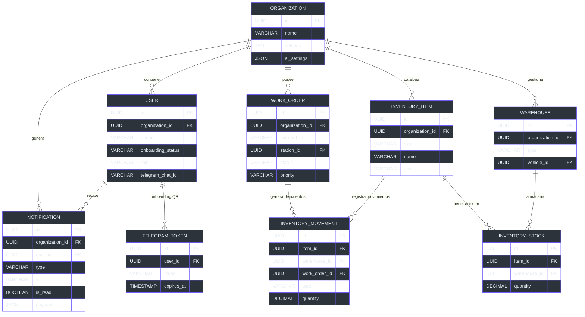
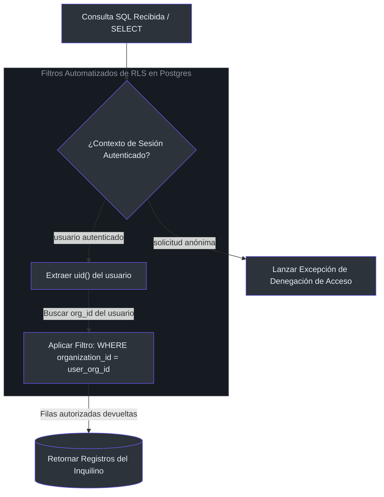

# Esquema de Base de Datos y Aislamiento Multi-Tenant

Para ofrecer soporte a múltiples organizaciones de mantenimiento industrial de forma simultánea bajo una única instancia de base de datos, **Manmec IA** implementa una arquitectura estructurada de aislamiento multi-inquilino (multi-tenant). El aislamiento de datos se garantiza a nivel del motor PostgreSQL mediante políticas de seguridad a nivel de fila (Row Level Security o RLS) y filtros del ORM Prisma.

---

## 1. Modelo Relacional de Entidad-Relación (ER)

El siguiente diagrama modela la estructura de relaciones de nuestras tablas centrales [CATALOGO_TABLAS.md](file:///C:/Users/siste/Documents/Antigravity_project/manmec/CATALOGO_TABLAS.md#L7-L121):



---

## 2. Row Level Security (RLS) y Seguridad Inquilino

Row Level Security (RLS) en Postgres representa nuestra barrera principal contra fugas accidentales de datos entre inquilinos [doc/arquitectura_stack.md](file:///C:/Users/siste/Documents/Antigravity_project/manmec/doc/arquitectura_stack.md#L30-L36).



Cada tabla con información de la operación debe incluir la columna `organization_id`. Al ejecutar una consulta, las políticas de RLS interceptan la instrucción y añaden automáticamente la claúsula `WHERE organization_id = CURRENT_USER_ORG()`, impidiendo que un usuario visualice o altere datos de otra empresa.

---

## 3. Uniones (Joins) y Relaciones en Base de Datos

Durante los flujos de automatización (como cierres automáticos), la aplicación realiza consultas complejas uniendo tablas a través del aislamiento del inquilino [src/app/api/webhooks/notifications/email/route.ts](file:///C:/Users/siste/Documents/Antigravity_project/manmec/src/app/api/webhooks/notifications/email/route.ts#L301-L364).

### Consulta de Conciliación de Repuestos

Cuando una orden de trabajo finaliza, el sistema:
1. Encuentra la bodega móvil asignada al mecánico principal.
2. Une la tabla `manmec_warehouse_items` con `manmec_warehouses` a través de `warehouse_id`.
3. Valida la disponibilidad del SKU solicitado antes de procesar el descuento.

```sql
-- Consulta conceptual para mapear repuestos y bodegas móviles asignadas
SELECT 
    wi.id, 
    wi.sku, 
    wi.stock_count, 
    w.id AS warehouse_id, 
    w.vehicle_id
FROM manmec_warehouse_items wi
JOIN manmec_warehouses w ON wi.warehouse_id = w.id
WHERE w.assigned_user_id = 'uuid_del_mecanico_asignado'
  AND wi.sku = 'SKU_DEL_REPUESTO';
```

---

## 4. Estructura de las Tablas Principales

### 4.1 `manmec_work_orders` (Seguimiento de Órdenes de Trabajo)
Registra los estados, mecánicos asignados y detalles de las tareas de mantenimiento [CATALOGO_TABLAS.md](file:///C:/Users/siste/Documents/Antigravity_project/manmec/CATALOGO_TABLAS.md#L20-L33).
* **`id`** (UUID, PK): Código identificador único del ticket.
* **`aviso`** (VARCHAR, Unique): Código alfanumérico externo de 8 dígitos de COPEC.
* **`organization_id`** (UUID, FK): Vincula la orden con el inquilino específico.
* **`assigned_to`** (UUID, FK): Relación con el técnico a cargo del trabajo.
* **`status`** (VARCHAR): Estado operativo (`PENDING`, `IN_PROGRESS`, `COMPLETED`, `CANCELLED`).

### 4.2 `manmec_inventory_items` + `manmec_inventory_stock` (Catálogo y Stock)

El inventario se divide en dos tablas separadas:

**`manmec_inventory_items`** — Catálogo maestro de repuestos:

* **`id`** (UUID, PK): Identificador único del repuesto.
* **`sku`** (VARCHAR): Código de catálogo (ej: `10026487`).
* **`name`** (VARCHAR): Nombre descriptivo del repuesto.
* **`unit`** (VARCHAR): Unidad de medida (`unidad`, `litro`, etc.).
* **`organization_id`** (UUID, FK): Aislamiento multi-tenant.

**`manmec_inventory_stock`** — Cantidades por bodega (tabla de unión):

* **`item_id`** (UUID, FK): Referencia al catálogo.
* **`warehouse_id`** (UUID, FK): Bodega que almacena el ítem.
* **`quantity`** (DECIMAL): Cantidad actual (puede ser negativa si `allow_negative_stock = true`).

### 4.3 `manmec_notifications` (Sistema de Notificaciones en Tiempo Real)

Generadas automáticamente por trigger de BD o por `createOrgNotification()` en el servidor:

* **`type`** (VARCHAR): `stock_deduction` | `shipment_received` | `transfer_initiated` | `low_stock`.
* **`payload`** (JSONB): Datos contextuales (item_name, quantity, ot_id, station_name, etc.).
* **`is_read`** (BOOLEAN): Marcado por el cliente vía `NotificationBell` component.
* El trigger `manmec_trg_stock_deduction_notification` genera una fila por cada usuario supervisor/manager/admin cuando hay un movimiento `OUT` en inventario.

### 4.4 `manmec_telegram_tokens` (Tokens de Onboarding QR)

Tokens temporales de un solo uso para vincular cuentas de Telegram:

* **`token`** (VARCHAR, UNIQUE): Token aleatorio embebido en el código QR.
* **`expires_at`** (TIMESTAMPTZ): Expiración corta (~15 min) para seguridad.
* Se elimina automáticamente tras verificación exitosa del número de teléfono.

---

## 5. Referencias

* **Estructura de las Tablas**: [CATALOGO_TABLAS.md](file:///C:/Users/siste/Documents/Antigravity_project/manmec/CATALOGO_TABLAS.md#L7-L121)
* **Conectores de Supabase**: [src/lib/ai/tools.ts](file:///C:/Users/siste/Documents/Antigravity_project/manmec/src/lib/ai/tools.ts#L6-L15)
* **Arquitectura de Políticas RLS**: [doc/arquitectura_stack.md](file:///C:/Users/siste/Documents/Antigravity_project/manmec/doc/arquitectura_stack.md#L30-L36)
* **Deducción de Repuestos en Webhook**: [src/app/api/webhooks/notifications/email/route.ts](file:///C:/Users/siste/Documents/Antigravity_project/manmec/src/app/api/webhooks/notifications/email/route.ts#L301-L364)
* **Validación de Enrolamiento en Webhook**: [src/app/api/telegram/webhook/route.ts](file:///C:/Users/siste/Documents/Antigravity_project/manmec/src/app/api/telegram/webhook/route.ts#L75-L128)
